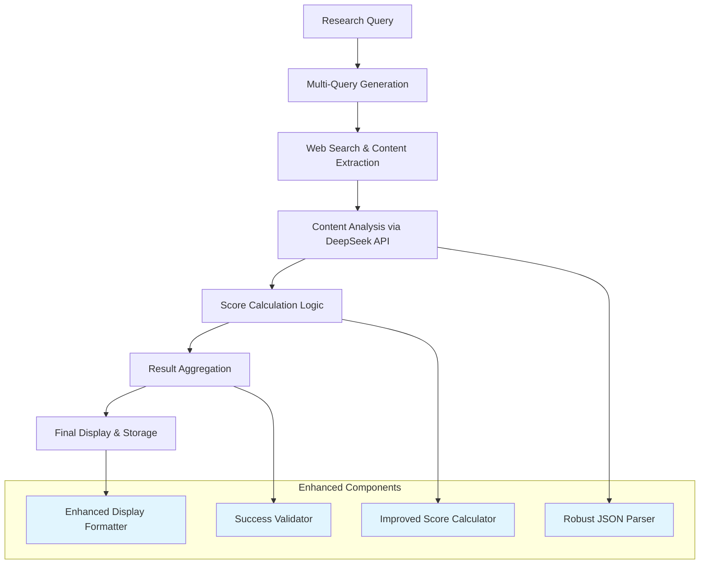

# Technical Design

## Overview

This design addresses critical issues in the comprehensive analysis generation and result summarization system in research system v3.07. The system currently extracts content from multiple high-quality sources successfully but fails to properly calculate final relevance scores and display comprehensive analysis, leading to incorrect failure reporting despite successful research execution.

## Architecture

The fix involves enhancing the existing research pipeline without disrupting the core architecture:



## Technology Stack

- **Backend**: Python 3.11+ with async/await patterns
- **AI API**: DeepSeek API via OpenAI SDK with streaming support
- **Database**: MongoDB with Motor async driver for caching
- **Content Extraction**: Bright Data API integration
- **Search**: Google Custom Search API
- **Logging**: Python logging module with structured output
- **Testing**: Existing test framework with enhanced validation

## Components and Interfaces

### 1. Enhanced Score Calculator

**Location**: Lines 2370-2384 in main research workflow

```python
class EnhancedScoreCalculator:
    def calculate_final_relevance_score(self, iterations: List[Dict]) -> Dict:
        """Calculate final relevance score using maximum from all iterations"""
        max_score = 0
        achieved_scores = []
        
        for iteration in iterations:
            if 'steps' in iteration and 'step4' in iteration['steps']:
                analysis = iteration['steps']['step4'].get('analysis', {})
                score = analysis.get('overall_relevance_score', 0)
                if score > 0:
                    achieved_scores.append(score)
                    max_score = max(max_score, score)
        
        return {
            'final_relevance_score': max_score,
            'target_achieved': max_score >= 7,  # configurable threshold
            'score_progression': achieved_scores,
            'calculation_method': 'maximum_iteration_score'
        }
```

### 2. Robust JSON Response Parser

**Location**: Lines 1850-1980 in analysis processing

```python
class RobustAPIResponseParser:
    def parse_analysis_response(self, response_text: str) -> Dict:
        """Parse DeepSeek API response with fallback handling"""
        try:
            # Try direct JSON parsing first
            if response_text.strip().startswith('{'):
                return json.loads(response_text)
        except json.JSONDecodeError:
            pass
        
        # Extract structured data from text response
        return self._extract_from_text_response(response_text)
    
    def _extract_from_text_response(self, text: str) -> Dict:
        """Extract key components from text-based responses"""
        result = {
            'analysis_content': text,
            'overall_relevance_score': self._extract_relevance_score(text),
            'confidence_indicators': self._extract_confidence_markers(text),
            'parsing_method': 'text_extraction'
        }
        return result
```

### 3. Enhanced Display Formatter

**Location**: Lines 2800-2820 in result display logic

```python
class EnhancedDisplayFormatter:
    def format_comprehensive_analysis(self, analysis_data: Dict) -> str:
        """Format comprehensive analysis for prominent display"""
        content = analysis_data.get('analysis_content', '')
        
        # Extract key sections
        sections = self._extract_analysis_sections(content)
        
        formatted_output = []
        formatted_output.append("📋 COMPREHENSIVE ANALYSIS SUMMARY:")
        formatted_output.append("=" * 60)
        
        if 'executive_summary' in sections:
            formatted_output.append(f"🎯 Executive Summary:\n{sections['executive_summary']}")
        
        if 'key_findings' in sections:
            formatted_output.append(f"📊 Key Findings:\n{sections['key_findings']}")
        
        if 'statistical_data' in sections:
            formatted_output.append(f"📈 Statistical Data:\n{sections['statistical_data']}")
        
        return "\n\n".join(formatted_output)
```

### 4. Success Determination Validator

**Location**: Lines 2825-2840 in success assessment logic

```python
class SuccessValidator:
    def determine_research_success(self, metrics: Dict, analysis: Dict) -> Dict:
        """Comprehensive success determination logic"""
        relevance_score = metrics.get('final_relevance_score', 0)
        target_threshold = 7  # configurable
        
        # Multiple success criteria
        criteria = {
            'relevance_threshold_met': relevance_score >= target_threshold,
            'analysis_content_available': bool(analysis.get('analysis_content')),
            'sources_processed': metrics.get('sources_analyzed', 0) > 0,
            'statistical_data_found': bool(analysis.get('statistical_summary'))
        }
        
        success_score = sum(criteria.values()) / len(criteria)
        
        return {
            'overall_success': success_score >= 0.75,
            'success_level': self._classify_success_level(success_score),
            'criteria_met': criteria,
            'success_reasoning': self._explain_success_determination(criteria)
        }
```

## API Endpoints

No new endpoints required - all fixes are internal to the existing research workflow.

**Existing Endpoint Enhanced**:
- Research execution flow in `test_deepseek_advanced_web_research3_07.py`

## Data Flow

### Enhanced Score Calculation Flow

1. **Individual Iteration Processing**: Each research iteration generates a relevance score
2. **Score Collection**: All iteration scores are collected during the research session
3. **Maximum Score Determination**: Final score uses the highest achieved score across all iterations
4. **Target Achievement Check**: Compare final score against configurable threshold (default: 7/10)
5. **Metadata Updates**: Update final_metrics with corrected scoring

### Improved Analysis Display Flow

1. **Content Extraction**: Retrieve comprehensive analysis from final iteration
2. **Section Parsing**: Extract key components (summary, findings, statistics)
3. **Format Enhancement**: Apply structured formatting for readability
4. **Prominent Display**: Show analysis prominently in final results
5. **Fallback Handling**: Graceful degradation for missing analysis content

## Data Models

### Enhanced Final Metrics Structure

```python
@dataclass
class EnhancedFinalMetrics:
    final_relevance_score: int  # Maximum score from all iterations
    target_achieved: bool       # True if score >= threshold
    iterations_completed: int   # Number of completed iterations
    total_duration: float      # Total research time
    score_progression: List[int]  # Scores from each iteration
    calculation_method: str    # How final score was determined
    success_level: str        # 'full', 'partial', 'failed'
    success_reasoning: str    # Explanation of success determination
```

### Robust Analysis Response Structure

```python
@dataclass
class EnhancedAnalysisResponse:
    analysis_content: str           # Main analysis text
    overall_relevance_score: int    # Extracted relevance score
    confidence_indicators: List[str] # Confidence markers found
    parsing_method: str            # How response was parsed
    structured_sections: Dict      # Extracted analysis sections
    statistical_summary: Optional[Dict]  # Statistical data if available
```

## Error Handling

### 1. Score Calculation Errors

```python
def handle_score_calculation_error(self, iterations: List[Dict]) -> Dict:
    """Fallback scoring when calculation fails"""
    logger.warning("Score calculation failed, using fallback method")
    
    # Use source count and quality as fallback
    total_sources = sum(len(iter.get('sources', [])) for iter in iterations)
    fallback_score = min(10, max(1, total_sources // 2))
    
    return {
        'final_relevance_score': fallback_score,
        'target_achieved': fallback_score >= 7,
        'calculation_method': 'fallback_source_based',
        'warning': 'Used fallback scoring due to calculation error'
    }
```

### 2. JSON Parsing Failures

```python
def handle_json_parsing_failure(self, response_text: str) -> Dict:
    """Graceful handling of malformed JSON responses"""
    logger.warning("JSON parsing failed, extracting key components from text")
    
    # Extract essential components even from malformed responses
    analysis_content = self._clean_response_text(response_text)
    relevance_score = self._extract_relevance_score_regex(response_text)
    
    return {
        'analysis_content': analysis_content,
        'overall_relevance_score': relevance_score,
        'parsing_method': 'text_extraction_fallback',
        'original_response': response_text[:500]  # For debugging
    }
```

### 3. Display Formatting Errors

```python
def handle_display_formatting_error(self, analysis_data: Dict) -> str:
    """Fallback display formatting when structured parsing fails"""
    logger.warning("Display formatting failed, using simple fallback")
    
    content = analysis_data.get('analysis_content', 'Analysis not available')
    score = analysis_data.get('overall_relevance_score', 0)
    
    return f"""
    📋 ANALYSIS SUMMARY:
    Score: {score}/10
    Content: {content[:1000]}{'...' if len(content) > 1000 else ''}
    """
```

## Security Considerations

- **Input Validation**: Sanitize all API responses before processing
- **Error Information**: Limit error details in logs to prevent information leakage
- **Resource Limits**: Maintain existing token limits and timeout constraints
- **Data Privacy**: Ensure cached content follows existing privacy patterns

## Performance & Scalability

### Optimization Strategies

1. **Minimal Performance Impact**: Changes focus on logic fixes without adding computational overhead
2. **Caching Preservation**: All existing MongoDB caching mechanisms remain intact
3. **Token Optimization**: Maintain existing token counting and management
4. **Memory Efficiency**: Score calculation uses minimal additional memory

### Performance Targets

- **Score Calculation**: <10ms additional processing time per research session
- **JSON Parsing**: <50ms for text extraction fallback methods
- **Display Formatting**: <20ms for enhanced analysis formatting
- **Memory Usage**: <5% increase in peak memory consumption

## Testing Strategy

### Unit Tests Required

```python
class TestEnhancedScoreCalculator:
    def test_maximum_score_selection(self):
        """Test that final score uses maximum from iterations"""
        
    def test_target_achievement_logic(self):
        """Test target achievement determination"""
        
    def test_fallback_scoring(self):
        """Test fallback scoring when iterations lack scores"""

class TestRobustAPIResponseParser:
    def test_valid_json_parsing(self):
        """Test normal JSON response parsing"""
        
    def test_malformed_json_handling(self):
        """Test text extraction fallback"""
        
    def test_relevance_score_extraction(self):
        """Test score extraction from various response formats"""

class TestEnhancedDisplayFormatter:
    def test_comprehensive_analysis_formatting(self):
        """Test structured analysis display"""
        
    def test_fallback_display_formatting(self):
        """Test simple fallback formatting"""

class TestSuccessValidator:
    def test_success_determination_criteria(self):
        """Test multi-criteria success evaluation"""
```

### Integration Tests Required

```python
class TestEndToEndResearchFlow:
    def test_score_calculation_integration(self):
        """Test complete research flow with enhanced scoring"""
        
    def test_analysis_display_integration(self):
        """Test analysis extraction and display pipeline"""
        
    def test_error_handling_integration(self):
        """Test graceful error handling throughout pipeline"""
```

### Regression Tests Required

- Verify all existing v3.07 functionality remains intact
- Confirm performance benchmarks are maintained
- Validate backward compatibility with previous result formats
- Ensure caching effectiveness is preserved

## Implementation Plan

### Phase 1: Core Logic Fixes (Priority: Critical)
1. **Fix final relevance score calculation** (lines 2376-2383)
   - Implement maximum score selection from iterations
   - Update target achievement logic
   - Add score progression tracking

2. **Enhance JSON response parsing** (lines 1930-1980)
   - Add robust parsing with fallback methods
   - Implement text extraction for malformed responses
   - Preserve structured data extraction

### Phase 2: Display Enhancement (Priority: Critical)
1. **Improve comprehensive analysis display** (lines 2800-2820)
   - Implement structured analysis formatting
   - Add prominent display of key findings
   - Ensure analysis content is always visible

2. **Enhanced success determination** (lines 2825-2840)
   - Implement multi-criteria success evaluation
   - Add detailed success reasoning
   - Provide clear success/partial/failure classifications

### Phase 3: Validation & Testing (Priority: High)
1. **Add comprehensive validation**
   - Implement analysis quality checks
   - Add content completeness validation
   - Ensure minimum quality thresholds

2. **Enhanced error handling and logging**
   - Add detailed logging for score calculations
   - Implement graceful degradation mechanisms
   - Add recovery options for partial failures

### Phase 4: Testing & Documentation (Priority: Medium)
1. **Comprehensive test suite**
   - Unit tests for all enhanced components
   - Integration tests for complete workflows
   - Regression tests for existing functionality

2. **Performance validation**
   - Benchmark enhanced logic performance
   - Validate memory usage patterns
   - Confirm caching effectiveness

## Integration Considerations

### Existing Architecture Integration
- **Tornado Framework**: All fixes integrate with existing async request handling
- **MongoDB Caching**: Enhanced logic works with existing cache infrastructure  
- **DeepSeek API**: Improved parsing handles existing API response patterns
- **Bright Data Integration**: No changes required to content extraction logic

### Backward Compatibility
- **Result Format**: Enhanced results maintain compatibility with existing JSON structure
- **Cache Keys**: Existing cache key formats and expiration remain unchanged
- **API Interfaces**: No changes to external API integration patterns
- **Log Format**: Enhanced logging maintains existing log structure with additional details

### Configuration Management
- **Environment Variables**: Reuse existing environment variable patterns
- **Thresholds**: Make success thresholds configurable via environment variables
- **Feature Flags**: Add optional feature flags for gradual rollout
- **Monitoring**: Integrate with existing performance monitoring infrastructure

## Deployment Considerations

### Rollout Strategy
1. **Development Testing**: Complete testing in development environment
2. **Gradual Rollout**: Deploy with feature flags for controlled activation
3. **Performance Monitoring**: Monitor key metrics during rollout
4. **Rollback Plan**: Maintain ability to revert to previous logic if needed

### Monitoring Points
- **Score Calculation Accuracy**: Track score calculation success rate
- **JSON Parsing Success**: Monitor API response parsing success rate  
- **Analysis Display Quality**: Track analysis content availability in results
- **Performance Impact**: Monitor processing time and memory usage changes

This design provides a comprehensive solution to fix the critical issues while maintaining the existing system's performance and reliability characteristics.