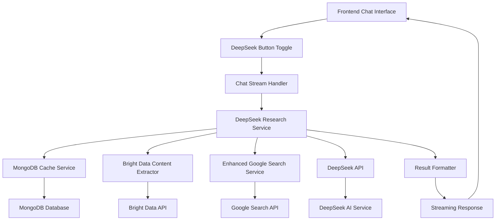

# Technical Design

## Overview
This design integrates the advanced web research algorithm from `test_deepseek_advanced_web_research3_07.py` as a "DeepSeek" button functionality in the existing chat interface. The integration provides users with sophisticated research capabilities including multi-query generation, content extraction, MongoDB caching, statistical analysis, and comprehensive result formatting through a seamless streaming interface.

**Implementation Note**: The core algorithm components and research workflow are already implemented and tested in `test_deepseek_advanced_web_research3_07.py`. The existing chat interface and streaming infrastructure are ready to integrate this algorithm. The task involves connecting the proven research algorithm to the DeepSeek button in the chat interface, enabling users to access advanced research capabilities through the existing streaming chat system.

## Architecture



## Technology Stack
- **Frontend**: Existing HTML/JavaScript with Server-Sent Events (SSE)
- **Backend**: Tornado async web framework with Python >=3.11
- **Database**: MongoDB (existing) with new caching collections
- **AI Services**: DeepSeek API (existing) + Google Search API (new)
- **Content Extraction**: Bright Data API (new)
- **Authentication**: Existing JWT/OAuth system
- **Testing**: Existing test infrastructure
- **Deployment**: Existing Gunicorn/Docker setup

## Components and Interfaces

### 1. Relevance Evaluation Components

#### RelevanceEvaluator
```python
class RelevanceEvaluator:
    def __init__(self, api_client: AsyncOpenAI, threshold: float = 0.7):
        self.api_client = api_client
        self.threshold = threshold
        self.evaluation_cache = {}
    
    async def evaluate_relevance(self, question: str, content: str, url: str) -> dict:
        """Evaluate content relevance on 0-10 scale"""
        pass
    
    async def batch_evaluate(self, question: str, contents: List[dict]) -> List[dict]:
        """Batch evaluation of multiple contents"""
        pass
    
    def meets_threshold(self, score: float) -> bool:
        """Check if score meets 70% threshold"""
        return score >= (self.threshold * 10)
```

#### AnswerAggregator
```python
class AnswerAggregator:
    def __init__(self):
        self.aggregated_answers = []
        self.deduplication_threshold = 0.8
    
    def aggregate_answers(self, evaluated_contents: List[dict]) -> List[dict]:
        """Aggregate answers scoring 70%+ and rank them"""
        pass
    
    def deduplicate_content(self, contents: List[dict]) -> List[dict]:
        """Remove duplicate content"""
        pass
    
    def rank_by_relevance(self, answers: List[dict]) -> List[dict]:
        """Rank answers by relevance score"""
        pass
```

#### SummaryGenerator
```python
class SummaryGenerator:
    def __init__(self, api_client: AsyncOpenAI, token_handler: TokenLimitHandler):
        self.api_client = api_client
        self.token_handler = token_handler
    
    async def generate_summary(self, question: str, best_answer: dict) -> dict:
        """Generate summary from highest relevance answer"""
        # Implementation already exists in test_deepseek_advanced_web_research3_07.py
        pass
    
    async def generate_statistical_summary(self, question: str, aggregated_data: List[dict]) -> dict:
        """Generate statistical summary with numerical data"""
        # Existing implementation provides comprehensive statistical analysis
        pass
    
    def create_summary_prompt(self, question: str, content: str) -> str:
        """Create prompt for summary generation"""
        # Proven prompt templates from existing implementation
        pass
    
    async def validate_summary(self, summary: str, original_question: str) -> bool:
        """Validate summary quality"""
        pass
    
    def format_with_statistics(self, summary: dict, statistics: dict) -> str:
        """Format summary with statistical data presentation"""
        # Enhanced formatting from existing implementation
        pass
```

### 2. Frontend Integration

#### DeepSeek Button Component
```javascript
class DeepSeekToggle {
    constructor(chatInterface) {
        this.chatInterface = chatInterface;
        this.isActive = false;
        this.progressIndicator = null;
    }
    
    toggle() {
        this.isActive = !this.isActive;
        this.updateUI();
    }
    
    updateUI() {
        // Visual state changes, progress indicators
    }
}
```

#### UI Modifications
- Add DeepSeek toggle button alongside existing Search/Deep Search buttons
- Implement progress indicators for 10-step research process
- Add streaming progress updates with step-by-step status
- Visual differentiation when DeepSeek mode is active

### 2. Backend Service Integration

#### Enhanced DeepSeek Research Service
```python
class EnhancedDeepSeekResearchService:
    def __init__(self, cache_expiry_days: int = None):
        # Get cache expiry from environment or use provided value
        expiry_days = cache_expiry_days or int(os.getenv('CACHE_EXPIRY_DAYS', 30))
        
        self.cache_service = MongoDBCacheService(expiry_days=expiry_days)
        self.content_extractor = BrightDataContentExtractor()
        self.search_service = EnhancedGoogleWebSearchService()
        self.result_formatter = ResultFormatter()
        self.time_manager = TimeManager()
        # New components for relevance evaluation and answer aggregation
        self.relevance_evaluator = RelevanceEvaluator()
        self.answer_aggregator = AnswerAggregator()
        self.summary_generator = SummaryGenerator()
    
    async def conduct_enhanced_research(self, question: str, target_relevance: int = 7) -> dict:
        # Main research orchestration method with relevance evaluation
        pass
    
    async def conduct_relevance_enhanced_research(self, question: str, relevance_threshold: float = 0.7) -> dict:
        # Enhanced research with relevance evaluation and answer aggregation
        pass
    
    async def evaluate_and_aggregate_results(self, question: str, extracted_contents: List[dict]) -> dict:
        # Evaluate relevance and aggregate high-quality answers
        pass
    
    async def stream_research_progress(self, chat_id: str, stream_queue: asyncio.Queue):
        # Stream progress updates during research
        pass
```

#### MongoDB Cache Integration
```python
class MongoDBCacheService:
    def __init__(self, db_connection, cache_expiry_days: int = 30):
        self.db = db_connection
        self.collection = self.db.web_content_cache
        self.cache_expiry_days = cache_expiry_days
        self.cache_expiry_seconds = cache_expiry_days * 24 * 60 * 60
    
    async def get_cached_content(self, url: str) -> Optional[dict]:
        # Retrieve cached content if fresh (≤cache_expiry_days)
        # Uses self.cache_expiry_days for freshness check
        pass
    
    async def cache_content(self, url: str, content: dict) -> bool:
        # Store extracted content with configurable expiry
        # Sets TTL based on self.cache_expiry_days
        pass
    
    async def get_cache_stats() -> dict:
        # Return cache statistics including expiry configuration
        pass
    
    def is_content_fresh(self, timestamp: datetime) -> bool:
        """Check if content is within cache expiry period"""
        age_days = (datetime.utcnow() - timestamp).days
        return age_days <= self.cache_expiry_days
```

### 3. API Endpoints

#### Enhanced Chat Stream Endpoint
```
POST /chat/stream
{
    "message": "user question",
    "chat_id": "uuid",
    "search_mode": "deepseek",  // New mode
    "chat_history": []
}

Response: Server-Sent Events stream
data: {"type": "research_step", "step": 1, "description": "Initializing MongoDB cache", "progress": 10}
data: {"type": "research_step", "step": 2, "description": "Generating search queries", "progress": 20}
...
data: {"type": "complete", "content": "formatted results", "search_results": [...]}
```

#### New Configuration Endpoint
```
GET /api/deepseek/config
Response: {
    "enabled": true,
    "apis_configured": {
        "google_search": true,
        "bright_data": true,
        "deepseek": true
    },
    "cache_stats": {
        "total_entries": 1250,
        "fresh_entries": 890
    }
}
```

### 4. Data Flow

1. **User Interaction**: User enables DeepSeek mode and submits question
2. **Request Processing**: ChatStreamHandler detects `search_mode: "deepseek"`
3. **Service Initialization**: EnhancedDeepSeekResearchService is instantiated
4. **Research Execution**: 10-step research process with streaming updates
5. **Content Extraction**: Web search and content extraction via Bright Data API
6. **Relevance Evaluation**: RelevanceEvaluator scores content relevance (0-10 scale)
7. **Threshold Filtering**: Filter content meeting 70% relevance threshold
8. **Answer Aggregation**: AnswerAggregator consolidates and ranks high-relevance answers
9. **Summary Generation**: SummaryGenerator creates comprehensive summary from best answers
10. **Progress Streaming**: Real-time progress sent via SSE to frontend
11. **Result Formatting**: Comprehensive results formatted for display with relevance metrics
12. **Storage**: Complete research results saved to chat history
13. **Cache Management**: Content cached in MongoDB for future use

## Data Models

### Research Cache Collection
```javascript
{
    _id: ObjectId,
    url: "https://example.com/page",
    content: {
        title: "Page Title",
        text: "Extracted content...",
        metadata: {...}
    },
    keywords: ["crm", "software", "japan"],
    timestamp: ISODate,
    expiry: ISODate,
    content_hash: "sha256_hash"
}
```

### Research Results Schema
```javascript
{
    message_id: "uuid",
    chat_id: "uuid",
    message: "formatted_research_results",
    type: "assistant",
    metadata: {
        research_type: "deepseek",
        iterations: 2,
        relevance_score: 8.5,
        sources_analyzed: 15,
        relevance_evaluation: {
            threshold_used: 0.7,
            sources_evaluated: 23,
            sources_meeting_threshold: 12,
            average_relevance_score: 7.8,
            evaluation_time: 45.2
        },
        answer_aggregation: {
            high_relevance_answers: 8,
            deduplicated_answers: 6,
            best_answer_score: 9.2,
            aggregation_time: 12.1
        },
        cache_performance: {
            hits: 8,
            misses: 7,
            hit_rate: 53.3
        },
        statistical_summary: {
            type: "numerical_ranking",
            source_count: 12,
            generation_time: 2.3
        }
    },
    search_results: [...]
}
```

### Relevance Evaluation Result Schema
```javascript
{
    content_id: "uuid",
    url: "https://example.com/page",
    relevance_score: 8.5,  // 0-10 scale
    evaluation_reason: "Content directly addresses CRM software ranking in Japan",
    meets_threshold: true,
    evaluation_time: "2025-08-04T12:00:00Z",
    token_usage: 150
}
```

### Aggregated Answer Schema
```javascript
{
    content: "Consolidated answer text...",
    relevance_score: 9.2,
    source_urls: ["https://example.com/1", "https://example.com/2"],
    confidence_level: "high",
    extraction_time: "2025-08-04T12:00:00Z",
    is_deduplicated: true,
    aggregation_metadata: {
        original_sources: 3,
        deduplication_applied: true,
        ranking_position: 1
    }
}
```

## Error Handling

### Graceful Degradation Strategy
1. **API Failures**: Retry with exponential backoff (3 attempts)
2. **Relevance Evaluation Failures**: Fallback to existing statistical summary generation
3. **70% Threshold Not Met**: Generate additional search queries and re-execute
4. **Summary Generation Failures**: Display raw data list instead
5. **Bright Data Unavailable**: Fallback to basic content extraction
6. **Google Search Limits**: Use cached results and continue with available data
7. **MongoDB Issues**: Continue research in memory-only mode
8. **Timeout Handling**: Save partial results and provide completion status

### Enhanced Error Handling Components
```python
class RelevanceEnhancedErrorHandler:
    def __init__(self, fallback_service):
        self.fallback_service = fallback_service
    
    async def handle_relevance_evaluation_error(self, error: Exception, contents: List[dict]) -> List[dict]:
        """Handle relevance evaluation errors with fallback"""
        logger.warning(f"Relevance evaluation failed, executing fallback: {error}")
        return await self.fallback_service.generate_statistical_summary()
    
    async def handle_threshold_not_met(self, question: str, current_results: List[dict]) -> List[str]:
        """Generate additional queries when threshold not met"""
        return await self.generate_followup_queries(question, current_results)
    
    async def handle_aggregation_failure(self, contents: List[dict]) -> dict:
        """Handle answer aggregation failures"""
        return await self.create_fallback_aggregation(contents)
```

### Error Response Format
```javascript
{
    type: "error",
    error_code: "API_TIMEOUT",
    message: "Research partially completed due to API timeout",
    partial_results: {...},
    retry_suggested: true
}
```

## Security Considerations

### API Key Management
- Store API keys in environment variables (existing pattern)
- Validate API access on service initialization
- Implement rate limiting for external API calls
- Log API usage for monitoring

### Content Validation
- Sanitize extracted web content before caching
- Validate URLs before content extraction
- Implement content size limits to prevent memory issues
- Filter sensitive information from cached content

### User Access Control
- Respect existing authentication system
- Implement usage quotas for DeepSeek functionality
- Log research requests for audit purposes
- Rate limit per-user research requests

## Performance & Scalability

### Optimization Strategies
1. **Caching**: Aggressive MongoDB caching with configurable expiry (default 30 days)
2. **Content Summarization**: Token-aware content truncation
3. **Parallel Processing**: Concurrent API calls where possible
4. **Queue Management**: Request queuing to prevent resource exhaustion
5. **Time Limits**: 10-minute hard timeout per research session

### Resource Management
```python
class ResourceManager:
    MAX_CONCURRENT_RESEARCH = 3
    MAX_CONTENT_LENGTH = 100000
    CACHE_EXPIRY_DAYS = 30
    API_RATE_LIMITS = {
        'bright_data': 100,  # per minute
        'google_search': 100,  # per day
        'deepseek': 60  # per minute
    }
```

### Scalability Considerations
- Horizontal scaling through multiple Tornado processes
- MongoDB sharding for large cache datasets
- CDN integration for static research assets
- Background job processing for heavy research tasks

## Testing Strategy

### Unit Testing
- Test individual service components (cache, extractor, formatter)
- Mock external API responses for consistent testing
- Validate data models and schema compliance
- Test error handling and edge cases

### Integration Testing
- End-to-end research workflow testing
- API integration testing with real services
- Database operations and caching functionality
- Streaming response validation

### Performance Testing
- Load testing with concurrent research requests
- Memory usage monitoring during large research tasks
- API rate limit compliance testing
- Timeout and resource cleanup validation

### Test Implementation
```python
class TestDeepSeekIntegration:
    async def test_research_workflow(self):
        # Test complete research process
        pass
    
    async def test_relevance_evaluation(self):
        # Test relevance scoring and threshold filtering
        pass
    
    async def test_answer_aggregation(self):
        # Test answer aggregation and deduplication
        pass
    
    async def test_summary_generation(self):
        # Test summary generation from best answers
        pass
    
    async def test_cache_performance(self):
        # Test caching efficiency
        pass
    
    async def test_streaming_responses(self):
        # Test SSE streaming functionality
        pass
    
    async def test_error_handling(self):
        # Test graceful degradation
        pass

class TestRelevanceEvaluator:
    async def test_relevance_scoring(self):
        """Test relevance scoring functionality"""
        pass
    
    async def test_threshold_filtering(self):
        """Test 70% threshold filtering"""
        pass

class TestAnswerAggregator:
    def test_deduplication(self):
        """Test duplicate content removal"""
        pass
    
    def test_ranking(self):
        """Test relevance-based ranking"""
        pass
```

## Integration with Existing System

### Chat Handler Modifications
- Extend `ChatStreamHandler` to detect `search_mode: "deepseek"`
- Integrate research service with existing streaming infrastructure
- Maintain compatibility with existing chat modes
- Preserve chat history integration

### Service Layer Integration
- Add `EnhancedDeepSeekResearchService` to service registry
- Integrate with existing `DeepSeekService` for consistency
- Maintain existing logging and monitoring patterns
- Use existing database connections and configuration

### Frontend Integration Points
- Extend existing button selection logic
- Integrate with current SSE handling code
- Maintain existing UI/UX patterns
- Add DeepSeek-specific progress indicators

### Database Schema Extensions
```python
# New collections
db.web_content_cache  # Content caching
db.research_sessions  # Research metadata
db.api_usage_logs     # API monitoring

# Extended message schema
messages.metadata.research_type = "deepseek"
messages.metadata.research_stats = {...}
```

## Deployment Considerations

### Environment Variables
```bash
# New required variables
GOOGLE_API_KEY=your_google_api_key
GOOGLE_CSE_ID=your_custom_search_engine_id
BRIGHTDATA_API_KEY=your_bright_data_api_key

# Optional configuration
DEEPSEEK_RESEARCH_TIMEOUT=600  # 10 minutes
CACHE_EXPIRY_DAYS=30          # MongoDB cache expiry in days (configurable)
MAX_CONCURRENT_RESEARCH=3
```

### Database Migrations
- Create new collections with proper indexes
- Set up configurable TTL indexes for cache expiry (based on CACHE_EXPIRY_DAYS)
- Create compound indexes for search optimization
- Implement data migration scripts for existing installations
- Update TTL indexes when CACHE_EXPIRY_DAYS environment variable changes

### Configuration Validation
```python
def validate_deepseek_config():
    required_vars = [
        'DEEPSEEK_API_KEY',
        'GOOGLE_API_KEY', 
        'GOOGLE_CSE_ID',
        'BRIGHTDATA_API_KEY'
    ]
    return all(os.getenv(var) for var in required_vars)
```

## Monitoring and Maintenance

### Key Metrics
- Research request volume and success rate
- API usage and rate limit compliance
- Cache hit/miss ratios and performance
- Research completion times and timeout rates
- User engagement with DeepSeek functionality

### Logging Strategy
- Structured logging for research sessions
- API call tracing and error logging
- Performance metrics collection
- User behavior analytics

### Maintenance Tasks
- Regular cache cleanup and optimization
- API key rotation and monitoring
- Performance tuning based on usage patterns
- User feedback collection and feature improvements

This design provides a comprehensive blueprint for integrating the advanced research capabilities while maintaining system consistency and providing excellent user experience through real-time streaming updates.
