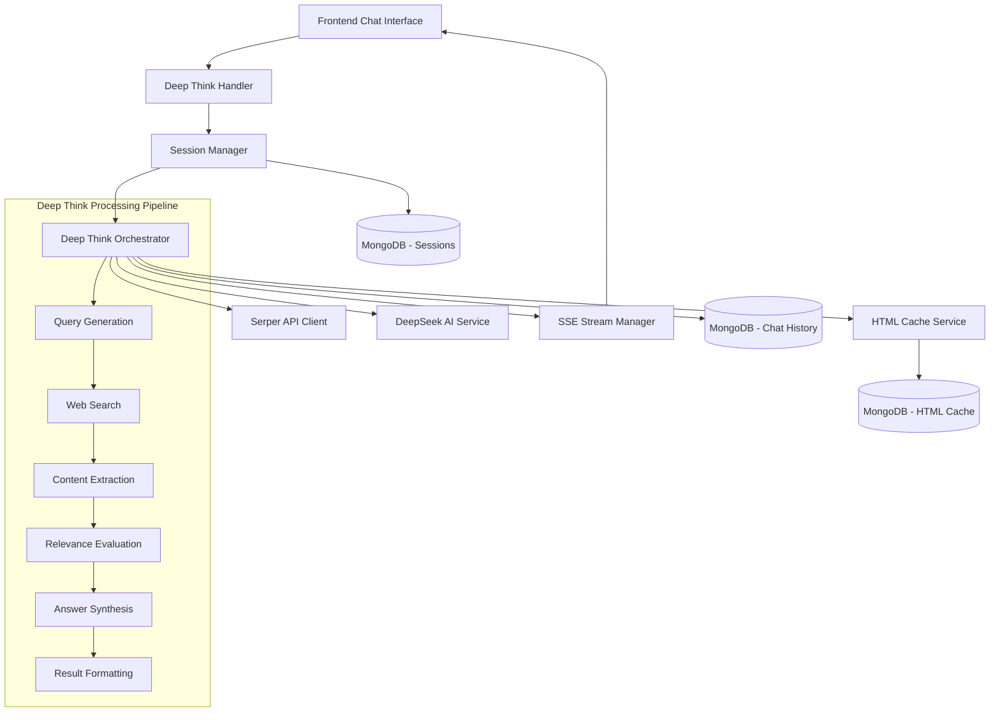
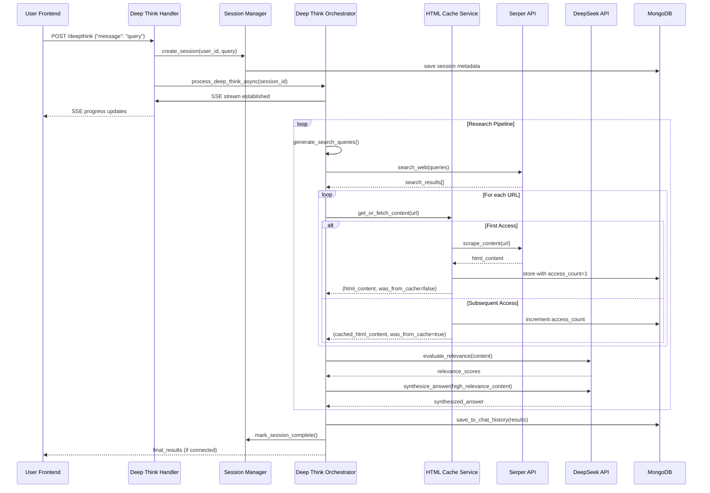
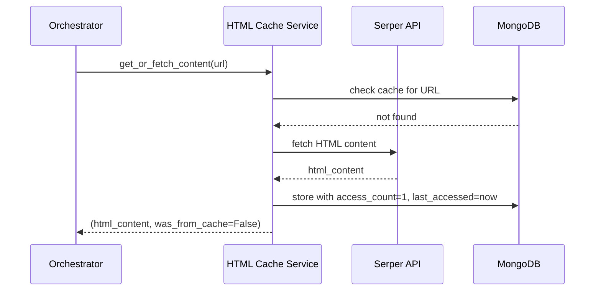
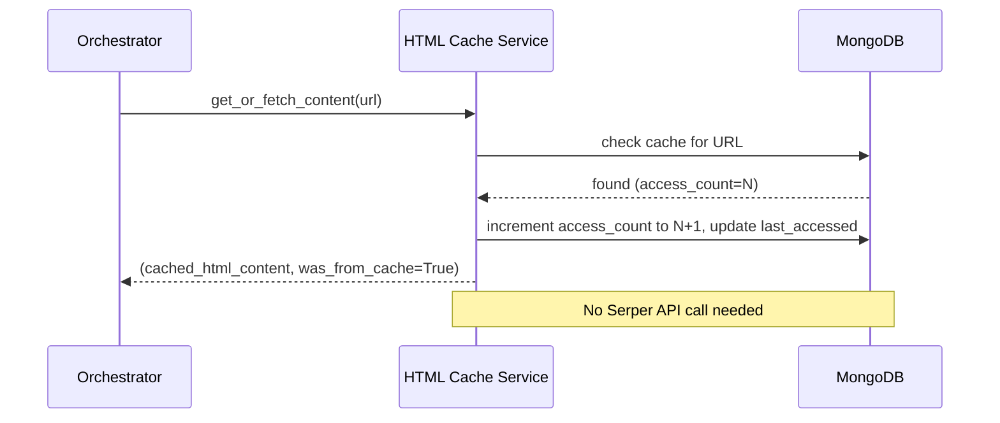
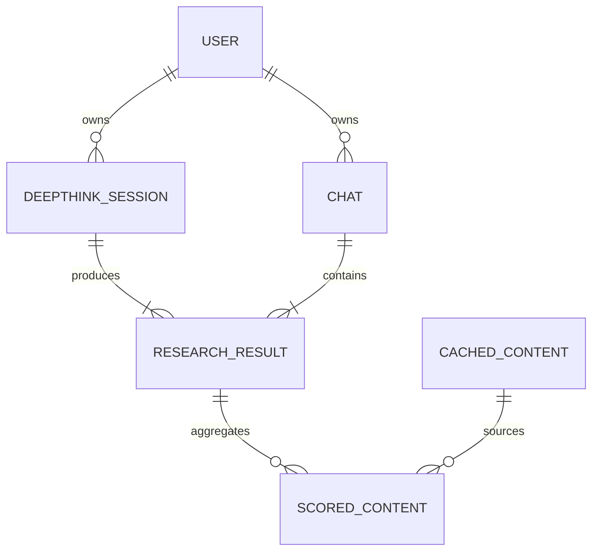

# Technical Design

## Overview

This technical design implements critical improvements to the dxee-china application's research functionality by streamlining the frontend interface and enhancing the Deep Think feature's reliability and performance. The solution leverages the proven workflow from `test_deepseek_advanced_web_research4_01.py` while implementing robust MongoDB-based HTML caching and session-resilient processing.

The design focuses on simplifying the user experience by consolidating similar functionality while ensuring uninterrupted research processing even when frontend sessions disconnect, maintaining the high-quality research output users expect from the platform.

## Requirements Mapping

### Design Component Traceability
Each design component addresses specific requirements:
- **Frontend UI Cleanup** → 1.1-1.7: Button removal and interface simplification
- **HTML Caching Service** → 2.1-2.11: MongoDB-based content caching with expiration and access counting
- **Simplified Deep Think Handler** → 3.1-3.7: Linear workflow based on proven algorithm
- **Session Management System** → 4.1-4.8: Persistent processing independent of frontend
- **Enhanced SSE Streaming** → 5.1-5.8: Reliable streaming with simplified retry logic
- **Chat History Integration** → 6.1-6.7: Seamless integration with existing conversation system

### User Story Coverage
- **UI Simplification**: Frontend cleanup removes redundant "Google Deep" and "DeepSeek" buttons while preserving core functionality
- **Performance Optimization**: MongoDB HTML caching with access counting reduces API calls and improves response times
- **Research Reliability**: Simplified workflow based on proven algorithm ensures consistent high-quality results  
- **Session Resilience**: Background processing continues even when browser disconnects
- **Real-time Feedback**: Enhanced streaming provides progress updates without complex retry logic
- **Conversation Continuity**: Results integrate seamlessly with chat history and conversation context

## Architecture



### Technology Stack
Based on existing architecture and proven patterns from the reference implementation:

- **Backend**: Tornado 6.4.2 (async web framework) with existing handler patterns
- **Database**: MongoDB with Motor 3.3.2 (async driver) for HTML caching and session management
- **AI Integration**: OpenAI 1.82.0 client for DeepSeek API with streaming support
- **Web Research**: Serper API via aiohttp 3.8.5 for search and content scraping
- **Content Processing**: BeautifulSoup4 4.12.3 and lxml 5.3.0 for HTML parsing
- **Streaming**: Server-Sent Events (SSE) via Tornado's async capabilities
- **Data Validation**: Pydantic 2.11.5 for model validation and serialization

### Architecture Decision Rationale

- **Why Tornado-based Design**: Maintains compatibility with existing async architecture while leveraging proven SSE streaming patterns
- **Why MongoDB for HTML Caching**: Integrates seamlessly with existing database infrastructure and provides flexible document storage for HTML content and metadata
- **Why Session-Resilient Architecture**: Decouples processing from frontend connection to ensure research continues even with network interruptions
- **Why Simplified Linear Workflow**: Based on proven `test_deepseek_advanced_web_research4_01.py` algorithm that demonstrates consistent high-quality results

### Data Flow

The system follows a linear processing pipeline optimized for reliability and performance:

#### Primary Deep Think Flow



#### HTML Cache Access Flow

**First Access (access_count = 1):**


**Subsequent Access (access_count = 2+):**


## Components and Interfaces

### Backend Services & Method Signatures

```python
class HTMLCacheService:
    def __init__(self, mongodb_service: MongoDBService):
        """Initialize with MongoDB service for caching operations"""
    
    async def get_or_fetch_content(self, url: str) -> Tuple[str, bool]:
        """Get cached content or fetch from Serper API with access counting
        Returns: (html_content, was_from_cache)"""
    
    async def get_cached_content(self, url: str) -> Optional[CachedContent]:
        """Retrieve cached HTML content if within expiration period"""
    
    async def cache_content(self, url: str, html_content: str, metadata: dict) -> None:
        """Store HTML content with expiration timestamp and metadata"""
    
    async def increment_access_counter(self, url: str) -> None:
        """Increment access counter and update last accessed time"""
    
    async def cache_content_with_counter(self, url: str, html_content: str) -> None:
        """Store HTML content with initial access count of 1"""
    
    async def is_cache_valid(self, cached_item: dict) -> bool:
        """Check if cached content is within expiration period"""
    
    async def cleanup_expired_cache(self) -> int:
        """Remove expired cache entries, returns count of removed items"""
    
    async def get_cache_statistics(self) -> Dict[str, Any]:
        """Get comprehensive cache usage statistics"""
    
    async def get_most_accessed_urls(self, limit: int = 10) -> List[Dict]:
        """Get most frequently accessed URLs"""

class DeepThinkSessionManager:
    def __init__(self, mongodb_service: MongoDBService):
        """Initialize with MongoDB service for session persistence"""
    
    async def create_session(self, user_id: str, query: str, chat_id: str) -> str:
        """Create persistent processing session independent of frontend connection"""
    
    async def update_session_progress(self, session_id: str, step: str, progress: int) -> None:
        """Update session progress for potential frontend reconnection"""
    
    async def mark_session_complete(self, session_id: str, results: dict) -> None:
        """Mark session as complete with success status"""
    
    async def get_session_status(self, session_id: str) -> Optional[dict]:
        """Retrieve current session status and progress"""

class SimplifiedDeepThinkOrchestrator:
    def __init__(self, html_cache: HTMLCacheService, session_manager: DeepThinkSessionManager):
        """Initialize with caching and session management services"""
    
    async def process_deep_think_request(self, session_id: str, query: str) -> AsyncGenerator[dict, None]:
        """Process deep think request following test_deepseek_advanced_web_research4_01.py workflow"""
    
    async def generate_search_queries(self, question: str) -> List[str]:
        """Generate multiple search queries for comprehensive coverage"""
    
    async def search_and_extract_content(self, queries: List[str]) -> List[ScoredContent]:
        """Search web and extract content using HTML caching"""
    
    async def evaluate_relevance(self, content: str, question: str) -> float:
        """Evaluate content relevance using DeepSeek API (0-10 scale)"""
    
    async def synthesize_final_answer(self, high_relevance_content: List[ScoredContent]) -> Answer:
        """Generate comprehensive analysis with statistics and source attribution"""

class EnhancedSSEStreamManager:
    def __init__(self):
        """Initialize SSE stream management with simplified retry logic"""
    
    async def establish_stream(self, handler: tornado.web.RequestHandler, session_id: str) -> bool:
        """Establish reliable SSE connection to frontend"""
    
    async def stream_progress_update(self, session_id: str, step: str, progress: int, data: dict) -> None:
        """Stream progress update if connection available"""
    
    async def stream_intermediate_results(self, session_id: str, insights: dict) -> None:
        """Stream intermediate insights during processing"""
    
    async def stream_completion(self, session_id: str, results: dict) -> None:
        """Stream final results followed by completion event"""
    
    def handle_connection_loss(self, session_id: str) -> None:
        """Handle connection loss without retry logic - processing continues"""

### Detailed Service Implementation

#### HTMLCacheService Implementation

```python
class HTMLCacheService:
    def __init__(self, mongodb_service: MongoDBService, cache_expiry_days: int = 30):
        self.mongodb_service = mongodb_service
        self.cache_expiry_days = cache_expiry_days
        self.logger = logging.getLogger(__name__)
    
    async def get_or_fetch_content(self, url: str) -> Tuple[str, bool]:
        """
        Get cached content or fetch from Serper API with access counting
        Returns: (html_content, was_from_cache)
        """
        # Check if URL exists in cache
        cached_item = await self._get_cached_item(url)
        
        if cached_item:
            # Cache exists - increment access counter
            await self.increment_access_counter(url)
            
            # Check if cache is still valid
            if await self.is_cache_valid(cached_item):
                self.logger.info(f"Cache hit for {url} (access #{cached_item['access_count'] + 1})")
                return cached_item['html_content'], True
            else:
                # Cache expired but exists - still use it and fetch fresh copy in background
                self.logger.info(f"Using expired cache for {url} while refreshing")
                asyncio.create_task(self._refresh_cache_background(url))
                return cached_item['html_content'], True
        
        # First access or no cache - fetch from Serper API
        html_content = await self._fetch_from_serper_api(url)
        await self.cache_content_with_counter(url, html_content)
        self.logger.info(f"First access for {url} - fetched from Serper API")
        return html_content, False
    
    async def increment_access_counter(self, url: str) -> None:
        """Increment access counter and update last accessed time"""
        await self.mongodb_service.get_collection('html_cache').update_one(
            {"url": url},
            {
                "$inc": {"access_count": 1},
                "$set": {
                    "last_accessed": datetime.utcnow(),
                    "updated_at": datetime.utcnow()
                }
            }
        )
    
    async def cache_content_with_counter(self, url: str, html_content: str) -> None:
        """Store HTML content with initial access count of 1"""
        now = datetime.utcnow()
        expiration_date = now + timedelta(days=self.cache_expiry_days)
        
        cache_document = {
            "url": url,
            "html_content": html_content,
            "retrieval_timestamp": now,
            "content_hash": hashlib.sha256(html_content.encode()).hexdigest(),
            "expiration_date": expiration_date,
            "access_count": 1,  # First access
            "last_accessed": now,
            "metadata": {
                "content_type": "text/html",
                "content_length": len(html_content),
                "status_code": 200
            },
            "created_at": now,
            "updated_at": now
        }
        
        await self.mongodb_service.get_collection('html_cache').replace_one(
            {"url": url}, 
            cache_document, 
            upsert=True
        )
    
    async def get_cache_statistics(self) -> Dict[str, Any]:
        """Get comprehensive cache usage statistics"""
        pipeline = [
            {
                "$group": {
                    "_id": None,
                    "total_urls": {"$sum": 1},
                    "total_accesses": {"$sum": "$access_count"},
                    "avg_accesses_per_url": {"$avg": "$access_count"},
                    "max_accesses": {"$max": "$access_count"},
                    "single_access_urls": {
                        "$sum": {"$cond": [{"$eq": ["$access_count", 1]}, 1, 0]}
                    },
                    "multi_access_urls": {
                        "$sum": {"$cond": [{"$gt": ["$access_count", 1]}, 1, 0]}
                    }
                }
            }
        ]
        
        collection = self.mongodb_service.get_collection('html_cache')
        result = await collection.aggregate(pipeline).to_list(1)
        return result[0] if result else {}
    
    async def get_most_accessed_urls(self, limit: int = 10) -> List[Dict]:
        """Get most frequently accessed URLs"""
        collection = self.mongodb_service.get_collection('html_cache')
        return await collection.find(
            {},
            {"url": 1, "access_count": 1, "last_accessed": 1}
        ).sort("access_count", -1).limit(limit).to_list(limit)
```

### Frontend Components

| Component Name | Responsibility | Props/State Summary |
|----------------|----------------|-------------------|
| ChatInterface | Main chat UI with simplified buttons | {messages, currentMode, streamingData} |
| ButtonGroup | Research mode selection (Search, Deep Search, Deep Think) | {selectedMode, onModeChange, isProcessing} |
| DeepThinkProgress | Real-time progress display for Deep Think | {progressData, step, percentage, insights} |
| MessageDisplay | Chat message rendering with research results | {message, researchData, sourceAttribution} |

### API Endpoints

| Method | Route | Purpose | Auth | Status Codes |
|--------|-------|---------|------|--------------|
| POST | /chat/deepthink | Initiate Deep Think processing | Required | 200, 400, 401, 500 |
| GET | /chat/deepthink/stream/:session_id | SSE stream for progress updates | Required | 200, 401, 404, 500 |
| GET | /chat/deepthink/status/:session_id | Get session status and results | Required | 200, 401, 404, 500 |
| GET | /chat/history/:chat_id | Retrieve chat history with Deep Think results | Required | 200, 401, 404, 500 |

## Data Models

### Domain Entities
1. **CachedContent**: HTML content with expiration metadata stored in MongoDB
2. **DeepThinkSession**: Persistent processing session independent of frontend connection
3. **ScoredContent**: Web content with relevance evaluation and confidence metrics
4. **ResearchResult**: Complete research output matching test_deepseek_advanced_web_research4_01.py format

### Entity Relationships


### Data Model Definitions

```python
@dataclass
class CachedContent:
    url: str
    html_content: str
    retrieval_timestamp: datetime
    content_hash: str
    expiration_date: datetime
    access_count: int
    last_accessed: datetime
    metadata: Dict[str, Any] = field(default_factory=dict)

@dataclass
class DeepThinkSession:
    session_id: str
    user_id: str
    query: str
    chat_id: str
    status: str  # "processing", "completed", "failed"
    current_step: str
    progress_percentage: int
    created_at: datetime
    updated_at: datetime
    results: Optional[Dict] = None

@dataclass
class ScoredContent:
    url: str
    title: str
    content: str
    relevance_score: float  # 0-10 scale
    confidence: float
    source_quality: int
    extraction_method: str
    timestamp: datetime = field(default_factory=datetime.utcnow)

@dataclass
class Answer:
    content: str
    confidence: float
    sources: List[str]
    statistics: Optional[Dict] = None
    gaps: List[str] = field(default_factory=list)
    versions: List[Dict] = field(default_factory=list)
    generation_time: float = 0.0

@dataclass
class ResearchResult:
    question: str
    answer: Answer
    queries_generated: int
    sources_analyzed: int
    cache_hits: int = 0
    total_duration: float = 0.0
    metadata: Dict[str, Any] = field(default_factory=dict)
```

### Database Schema

MongoDB collections for the enhanced system:

```javascript
// HTML Cache Collection
{
  _id: ObjectId,
  url: "string",
  html_content: "string", 
  retrieval_timestamp: ISODate,
  content_hash: "string",
  expiration_date: ISODate,
  access_count: "number", // NEW: Number of times URL has been accessed
  last_accessed: ISODate, // NEW: Last access timestamp
  metadata: {
    content_type: "string",
    content_length: "number",
    status_code: "number"
  },
  created_at: ISODate,
  updated_at: ISODate
}

// Deep Think Sessions Collection
{
  _id: ObjectId,
  session_id: "string",
  user_id: "string", 
  query: "string",
  chat_id: "string",
  status: "string", // processing, completed, failed
  current_step: "string",
  progress_percentage: "number",
  results: {
    // ResearchResult structure matching test_deepseek_advanced_web_research4_01.py
  },
  created_at: ISODate,
  updated_at: ISODate
}

// Enhanced Messages Collection (extend existing)
{
  // ... existing fields
  research_data: {
    type: "deepthink",
    session_id: "string",
    confidence: "number",
    sources: ["string"],
    statistics: {},
    processing_metadata: {}
  }
}
```

### Database Indexes

```javascript
// HTML Cache Collection Indexes
db.html_cache.createIndex({ "url": 1 }, { unique: true })
db.html_cache.createIndex({ "expiration_date": 1 })
db.html_cache.createIndex({ "retrieval_timestamp": 1 })
db.html_cache.createIndex({ "access_count": -1 }) // NEW: For analytics
db.html_cache.createIndex({ "last_accessed": -1 }) // NEW: For cleanup by usage

// Deep Think Sessions Collection Indexes  
db.deepthink_sessions.createIndex({ "session_id": 1 }, { unique: true })
db.deepthink_sessions.createIndex({ "user_id": 1, "created_at": -1 })
db.deepthink_sessions.createIndex({ "status": 1 })
```

### Migration Strategy

1. **HTML Cache Collection**: New collection, no migration needed
2. **Deep Think Sessions Collection**: New collection, no migration needed  
3. **Messages Collection Enhancement**: Add optional `research_data` field with backward compatibility
4. **Index Creation**: Create new indexes for performance optimization during deployment

## Error Handling

### Comprehensive Error Handling Strategy

```python
class DeepThinkError(Exception):
    """Base exception for Deep Think processing errors"""
    pass

class HTMLCacheError(DeepThinkError):
    """HTML caching related errors"""
    pass

class SessionError(DeepThinkError):
    """Session management errors"""
    pass

class StreamingError(DeepThinkError):
    """SSE streaming errors"""
    pass

# Error handling patterns
try:
    result = await process_deep_think_request(session_id, query)
except SerperAPIError as e:
    logger.error(f"Serper API error: {e}")
    # Fallback to cached content if available
    await handle_serper_api_fallback(session_id)
except DeepSeekAPIError as e:
    logger.error(f"DeepSeek API error: {e}")
    # Graceful degradation with basic response
    await provide_fallback_response(session_id)
except HTMLCacheError as e:
    logger.warning(f"Cache error (non-critical): {e}")
    # Continue without caching
except StreamingError as e:
    logger.info(f"Streaming disconnected: {e}")
    # Continue processing in background
except Exception as e:
    logger.exception("Unexpected Deep Think error")
    await mark_session_failed(session_id, str(e))
```

## Security Considerations

- **Input Validation**: Comprehensive validation of user queries and API responses using Pydantic models
- **API Rate Limiting**: Respect Serper and DeepSeek API rate limits with exponential backoff
- **Data Privacy**: HTML cache and session data stored locally in MongoDB with configurable expiration
- **Authentication**: All endpoints require valid JWT authentication following existing patterns
- **Content Sanitization**: HTML content sanitized before storage and processing to prevent XSS

## Performance & Scalability

### Performance Targets
| Metric | Target | Measurement |
|--------|--------|-------------|
| Deep Think Response Time (p95) | < 30s | End-to-end research pipeline |
| HTML Cache Hit Rate | > 60% | MongoDB cache statistics |
| Concurrent Sessions | > 10 | Simultaneous Deep Think processes |
| Session Recovery Time | < 2s | Frontend reconnection time |
| MongoDB Query Performance (p99) | < 100ms | Cache and session queries |

### Caching Strategy
- **HTML Content Cache**: MongoDB-based with 30-day default expiration and access counting
- **Smart Access Counting**: First access fetches from Serper API, subsequent accesses use cache
- **Cache Hit Optimization**: Second and later accesses avoid external API calls completely
- **Graceful Degradation**: Use expired cache if API fails
- **Cache Statistics**: Comprehensive analytics including access patterns and usage frequency
- **Usage-Based Cleanup**: Priority cleanup based on access_count and last_accessed timestamps

### Scalability Approach
- **Async Processing**: Non-blocking operations throughout pipeline
- **Session Persistence**: Processing continues independent of frontend connections
- **Database Optimization**: Efficient indexes for cache and session queries
- **Resource Management**: Configurable limits on concurrent Deep Think sessions

## Testing Strategy

### Risk Matrix
| Area | Risk | Must | Optional | Ref |
|---|---|---|---|---|
| HTML Caching | M | Unit, Integration | Performance | 2.1-2.7 |
| Session Management | H | Unit, Integration, E2E | Resilience | 4.1-4.8 |
| Deep Think Pipeline | H | Unit, Integration, E2E | Load | 3.1-3.7 |
| SSE Streaming | M | Unit, Contract | A11y | 5.1-5.8 |
| Frontend Cleanup | L | Unit, E2E | Visual | 1.1-1.7 |

### Minimal by Layer
- **Unit**: Core business logic for caching, session management, and research pipeline
- **Integration**: MongoDB operations, Serper/DeepSeek API interactions, SSE streaming
- **Contract**: API endpoint specifications and response formats
- **E2E (≤3)**: Complete Deep Think workflow, session recovery, frontend button cleanup

### Test Implementation
```python
# Unit Tests
async def test_html_cache_service_stores_and_retrieves_content():
    """Test HTML caching with expiration validation"""

async def test_html_cache_access_counter_first_access():
    """Test first access sets access_count to 1 and fetches from Serper API"""
    cache_service = HTMLCacheService(mongodb_service)
    url = "https://example.com/test"
    
    content, was_from_cache = await cache_service.get_or_fetch_content(url)
    
    assert was_from_cache == False
    cached_item = await cache_service._get_cached_item(url)
    assert cached_item['access_count'] == 1

async def test_html_cache_access_counter_subsequent_access():
    """Test subsequent access increments counter and uses cached content"""
    cache_service = HTMLCacheService(mongodb_service)
    url = "https://example.com/test"
    
    # First access
    await cache_service.get_or_fetch_content(url)
    
    # Second access
    content, was_from_cache = await cache_service.get_or_fetch_content(url)
    
    assert was_from_cache == True
    cached_item = await cache_service._get_cached_item(url)
    assert cached_item['access_count'] == 2

async def test_cache_statistics_calculation():
    """Test cache usage statistics with access counting"""
    cache_service = HTMLCacheService(mongodb_service)
    
    # Create test data with different access counts
    await cache_service.get_or_fetch_content("https://example1.com")  # access_count = 1
    await cache_service.get_or_fetch_content("https://example2.com")  # access_count = 1
    await cache_service.get_or_fetch_content("https://example2.com")  # access_count = 2
    
    stats = await cache_service.get_cache_statistics()
    
    assert stats['total_urls'] == 2
    assert stats['total_accesses'] == 3
    assert stats['single_access_urls'] == 1
    assert stats['multi_access_urls'] == 1

async def test_session_manager_handles_disconnected_frontend():
    """Test session continues processing when frontend disconnects"""

async def test_deep_think_orchestrator_follows_reference_workflow():
    """Test workflow matches test_deepseek_advanced_web_research4_01.py patterns"""

# Integration Tests  
async def test_complete_deep_think_pipeline_with_caching():
    """Test end-to-end research with HTML caching and session persistence"""

async def test_sse_streaming_with_connection_loss():
    """Test streaming behavior when frontend connection is lost"""

async def test_cache_performance_with_repeated_urls():
    """Test that repeated URL access improves performance by avoiding API calls"""
    # Measure time for first access (should fetch from API)
    # Measure time for subsequent accesses (should use cache)
    # Assert subsequent accesses are significantly faster

# E2E Tests
def test_frontend_button_cleanup_removes_google_deep_and_deepseek():
    """Test UI shows only Search, Deep Search, and Deep Think buttons"""

def test_deep_think_results_saved_to_chat_history():
    """Test research results appear in chat history after completion"""

def test_cache_analytics_dashboard_displays_usage_metrics():
    """Test cache statistics are properly displayed in analytics"""
```

### CI Gates
| Stage | Run | Gate | SLA |
|---|---|---|---|
| PR | Unit + Contract | Fail = block | ≤5m |
| Staging | Integration + E2E | Fail = block | ≤15m |
| Production | Smoke tests | Regression → issue | ≤2m |

### Exit Criteria
- Sev1/Sev2 = 0
- All gates passed
- Performance targets met: cache hit rate >60%, session recovery <2s
- Frontend cleanup verified: only essential buttons displayed
- Deep Think pipeline produces results matching reference JSON structure