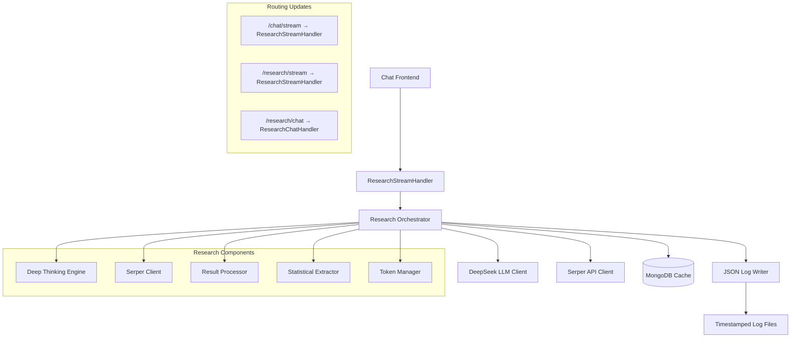
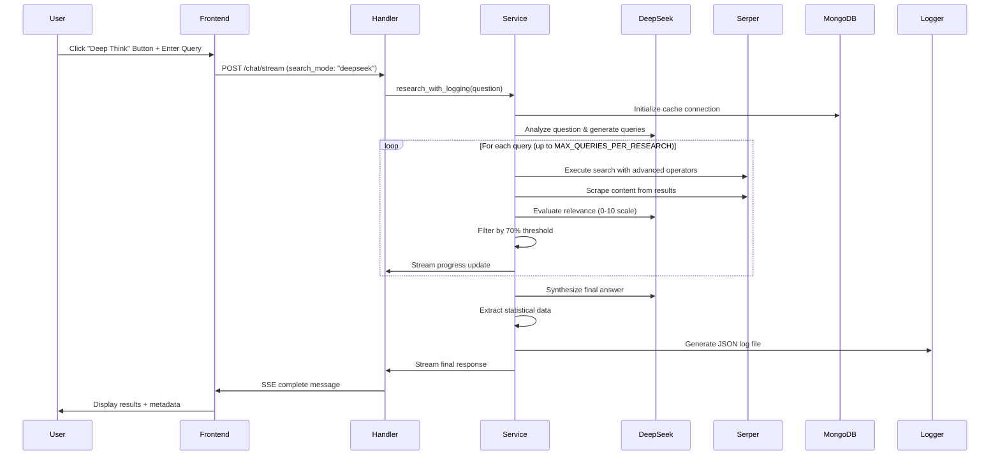
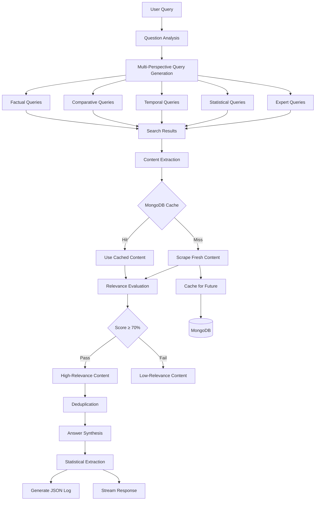
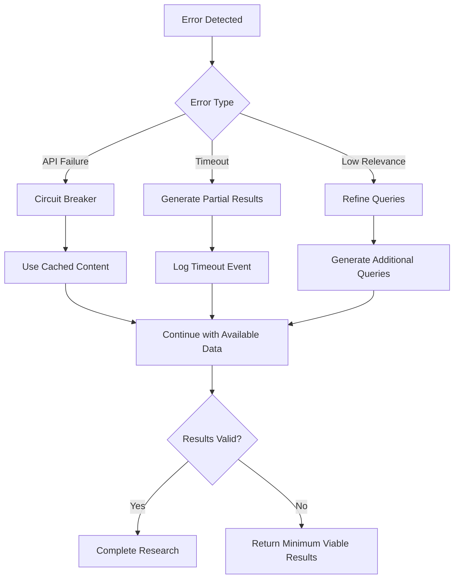

# Technical Design

## Overview

This feature integrates the advanced web research algorithm from `test_deepseek_advanced_web_research4_01.py` into the existing frontend/backend system with standardized JSON logging capabilities. The implementation ensures complete algorithm compatibility while producing research result logs that exactly match the format and structure of the reference `research_results_20250904_104734.json` file.

**Purpose**: This feature delivers comprehensive web research capabilities with deep-thinking query generation and structured logging to research professionals and system administrators.

**Users**: Research professionals will utilize this for in-depth topic investigation, while system administrators will benefit from consistent log analysis and comparison processes.

**Impact**: Replaces the current 'Deep Think' mode in the existing chat system with the sophisticated research algorithm from test_deepseek_advanced_web_research4_01.py, maintaining compatibility with the proven test algorithm while enabling systematic analysis of research outputs through standardized logging.

### Goals

- Integrate the exact research algorithm from test_deepseek_advanced_web_research4_01.py into production
- Generate JSON logs matching the reference format and the same messages for consistent analysis
- Replace current 'Deep Think' mode with the test_deepseek_advanced_web_research4_01.py algorithm implementation
- Maintain performance optimization through intelligent caching and resource management

### Non-Goals

- Modifying the core algorithm logic or research methodology
- Creating new research approaches beyond the tested implementation
- Integration points with external analytics systems (deferred to future phases)
- Custom log format variations outside the established schema

## Architecture

### Existing Architecture Analysis

The current system employs a well-established async-first architecture with clear separation of concerns:

- **Handler Layer**: Tornado RequestHandlers manage HTTP requests and streaming responses
- **Service Layer**: Business logic services handle AI integration, database operations, and external APIs
- **Frontend Integration**: HTML templates with embedded JavaScript for real-time chat functionality
- **Database**: MongoDB for persistence with established chat, user, and caching patterns
- **Streaming**: Server-Sent Events (SSE) for real-time progress updates and response streaming

The existing `enhanced_deepseek_research_service.py` and `deepthink_handler.py` will be updated to implement the test algorithm, replacing the current Deep Think functionality while maintaining the same `search_mode` parameter interface.

### High-Level Architecture



### Technology Alignment

**Integration with Existing Stack**:
- Leverages established Tornado handlers for HTTP/SSE communication
- Utilizes existing MongoDB patterns for caching and persistence
- Integrates with current DeepSeek service architecture through AsyncOpenAI
- Maintains compatibility with existing authentication and session management

**New Dependencies Introduced**:
- **Serper API Client**: Professional web search and content scraping (already partially implemented)
- **Enhanced Token Management**: Advanced tiktoken integration for content optimization
- **Progressive Answer Building**: Confidence tracking and version management system

**Key Design Decisions**:

**Decision**: Direct algorithm port from test file to production service
**Context**: Need to maintain exact algorithm behavior while integrating with production infrastructure
**Alternatives**: Refactor algorithm logic, create wrapper service, build new research system
**Selected Approach**: Extract algorithm components into production service classes while preserving core logic
**Rationale**: Ensures algorithm compatibility while enabling proper integration with existing infrastructure patterns
**Trade-offs**: Gain production reliability and integration vs. accept some code duplication during transition

**Decision**: JSON file-based logging with matching schema
**Context**: Requirement for exact log format compatibility with reference output
**Alternatives**: Database logging, structured logging service, custom analytics integration
**Selected Approach**: Generate timestamped JSON files with identical schema structure
**Rationale**: Provides immediate compatibility with existing analysis tools and comparison processes
**Trade-offs**: Gain format consistency and tool compatibility vs. accept file-based storage limitations

**Decision**: Replace existing Deep Think functionality rather than add new interface
**Context**: Need to upgrade research capability while maintaining existing user workflow
**Alternatives**: Add separate research mode, create new research interface, maintain parallel systems
**Selected Approach**: Replace current Deep Think button functionality with test_deepseek_advanced_web_research4_01.py algorithm
**Rationale**: Provides superior research capability while maintaining familiar user interface and workflow
**Trade-offs**: Gain advanced research features vs. lose current Deep Think implementation

## System Flows

### Research Workflow Sequence



### Data Processing Flow



## Requirements Traceability

| Requirement | Requirement Summary | Components | Interfaces | Flows |
|-------------|-------------------|------------|------------|-------|
| 1.1 | Algorithm compatibility with test_deepseek_advanced_web_research4_01.py | ResearchAlgorithmService, DeepThinkingEngine, SerperClient | research_with_logging(), generate_queries() | Research Workflow Sequence |
| 2.1 | JSON log format compliance with research_results_20250904_104734.json | JSONLogWriter, StatisticalExtractor | generate_log_output(), extract_statistics() | Data Processing Flow |
| 3.1 | Research workflow orchestration with timeout management | ResearchOrchestrator, ProgressTracker | orchestrate_research(), track_progress() | Research Workflow Sequence |
| 4.1 | Performance optimization through caching integration | MongoDBCacheService, TokenManager | get_cached_content(), optimize_content() | Data Processing Flow |
| 5.1 | Statistical data extraction from research sources | StatisticalExtractor, ContentProcessor | extract_statistics(), process_content() | Data Processing Flow |
| 6.1 | Log analysis and comparison capabilities | JSONLogWriter, LogAnalyzer | write_log_file(), compare_logs() | Research Workflow Sequence |

## Components and Interfaces

### Research Algorithm Service

#### Responsibility & Boundaries
- **Primary Responsibility**: Execute the complete research algorithm workflow from test_deepseek_advanced_web_research4_01.py within the production environment
- **Domain Boundary**: Research execution and coordination domain, interfacing with AI reasoning, web search, and content processing
- **Data Ownership**: Research session state, query generation results, and orchestration metadata
- **Transaction Boundary**: Complete research session from initiation to final JSON log generation

#### Dependencies
- **Inbound**: ChatHandler, API endpoints requiring research capabilities
- **Outbound**: DeepSeekClient, SerperClient, MongoDBCacheService, JSONLogWriter
- **External**: DeepSeek API for LLM reasoning, Serper API for web search and scraping, MongoDB for caching

#### Contract Definition

**Service Interface**:
```typescript
interface ResearchAlgorithmService {
  research_with_logging(question: string, timeout?: number): Promise<ResearchResult>;
  get_research_progress(session_id: string): ResearchProgressState;
  cancel_research(session_id: string): Promise<boolean>;
}

interface ResearchResult {
  question: string;
  answer: string;
  confidence: number;
  sources: string[];
  statistics: StatisticalData;
  metadata: ResearchMetadata;
  duration: number;
}

interface StatisticalData {
  numbers_found: string[];
  percentages: string[];
  dates: string[];
  metrics: Record<string, any>;
}

interface ResearchMetadata {
  relevance_threshold: number;
  timeout_reached: boolean;
  serper_requests: number;
  cache_hits?: number;
}
```

- **Preconditions**: Valid research question provided, API keys configured, MongoDB connection established
- **Postconditions**: Complete research result with JSON log file generated, all resources cleaned up
- **Invariants**: Research session state remains consistent, timeout limits enforced, cache integrity maintained

### Deep Thinking Query Engine

#### Responsibility & Boundaries
- **Primary Responsibility**: Generate multi-perspective search queries using the exact patterns from test_deepseek_advanced_web_research4_01.py
- **Domain Boundary**: Query strategy and generation domain, transforming research questions into optimized search queries
- **Data Ownership**: Generated query sets, question analysis results, and query prioritization metadata
- **Transaction Boundary**: Single question analysis and complete query set generation

#### Dependencies
- **Inbound**: ResearchAlgorithmService requesting query generation
- **Outbound**: DeepSeekClient for question analysis and reasoning
- **External**: DeepSeek API for natural language understanding and query optimization

#### Contract Definition

**Service Interface**:
```typescript
interface DeepThinkingEngine {
  generate_queries(question: string, max_queries?: number): Promise<SearchQuery[]>;
  analyze_question(question: string): Promise<QuestionAnalysis>;
  prioritize_queries(queries: SearchQuery[]): SearchQuery[];
}

interface SearchQuery {
  text: string;
  priority: number;
  search_type: 'GENERAL' | 'NEWS' | 'ACADEMIC' | 'TECHNICAL' | 'BUSINESS';
  advanced_operators?: SearchOperators;
}

interface QuestionAnalysis {
  main_topic: string;
  subtopics: string[];
  entities: string[];
  intent: string;
  scope: string;
  domain: string;
}

interface SearchOperators {
  site?: string;
  filetype?: string;
  intitle?: string;
  time_filter?: string;
  exact_phrase?: string;
  exclude_terms?: string[];
}
```

### Serper Integration Client

#### Responsibility & Boundaries
- **Primary Responsibility**: Execute web searches and content scraping using Serper API with exact methodology from the test algorithm
- **Domain Boundary**: External web search and content extraction domain, managing API communication and rate limiting
- **Data Ownership**: Search results, scraped content, and extraction metadata
- **Transaction Boundary**: Individual search requests and content scraping operations

#### Dependencies
- **Inbound**: ResearchAlgorithmService and query execution components
- **Outbound**: HTTP client for API communication, rate limiting service
- **External**: Serper API for search and scraping operations

**External Dependencies Investigation**:
The Serper API provides professional web search and content scraping capabilities:
- **API Endpoints**: google.serper.dev/search for search, scrape.serper.dev for content extraction
- **Authentication**: X-API-KEY header with API key
- **Rate Limits**: Approximately 1 request per second recommended for sustained usage
- **Content Types**: Supports organic search results, news, academic sources with advanced operators
- **Scraping Features**: Full text extraction, markdown conversion, metadata extraction
- **Response Format**: JSON with structured organic results, cached page links, and rich metadata
- **Error Handling**: Standard HTTP status codes, detailed error messages for debugging

#### Contract Definition

**Service Interface**:
```typescript
interface SerperClient {
  search(query: SearchQuery): Promise<SearchResult[]>;
  scrape(url: string, include_markdown?: boolean): Promise<ScrapeResult | null>;
  get_request_count(): number;
}

interface SearchResult {
  url: string;
  title: string;
  snippet: string;
  position: number;
  domain: string;
  cached_url?: string;
}

interface ScrapeResult {
  url: string;
  text: string;
  markdown?: string;
  metadata: Record<string, any>;
  extraction_time: number;
}
```

### Content Processing Pipeline

#### Responsibility & Boundaries
- **Primary Responsibility**: Process search results, evaluate relevance using DeepSeek LLM, and apply filtering logic identical to the test algorithm
- **Domain Boundary**: Content analysis and filtering domain, managing relevance scoring and content optimization
- **Data Ownership**: Scored content, relevance evaluations, and filtered result sets
- **Transaction Boundary**: Batch processing of search results with relevance evaluation

#### Dependencies
- **Inbound**: ResearchAlgorithmService providing raw search results
- **Outbound**: DeepSeekClient for relevance evaluation, TokenManager for optimization
- **External**: DeepSeek API for content relevance scoring

#### Contract Definition

**Service Interface**:
```typescript
interface ContentProcessor {
  process_search_results(results: SearchResult[], question: string): Promise<ScoredContent[]>;
  filter_by_relevance(contents: ScoredContent[], threshold?: number): ScoredContent[];
  deduplicate_contents(contents: ScoredContent[]): ScoredContent[];
}

interface ScoredContent {
  url: string;
  title: string;
  content: string;
  relevance_score: number;
  confidence: number;
  source_quality: number;
  extraction_method: string;
  timestamp: string;
}
```

### Answer Synthesis Engine

#### Responsibility & Boundaries
- **Primary Responsibility**: Combine high-relevance content into comprehensive answers using DeepSeek LLM with exact synthesis methodology
- **Domain Boundary**: Content synthesis and statistical analysis domain, generating final research outputs
- **Data Ownership**: Synthesized answers, statistical extractions, and confidence metrics
- **Transaction Boundary**: Complete answer generation from filtered content set

#### Contract Definition

**Service Interface**:
```typescript
interface AnswerSynthesizer {
  synthesize_answer(question: string, contents: ScoredContent[]): Promise<string>;
  extract_statistics(contents: ScoredContent[]): Promise<StatisticalData>;
  calculate_confidence(contents: ScoredContent[]): number;
}
```

### JSON Logging Service

#### Responsibility & Boundaries
- **Primary Responsibility**: Generate timestamped JSON log files with exact schema matching research_results_20250904_104734.json
- **Domain Boundary**: Logging and serialization domain, ensuring format compliance and file management
- **Data Ownership**: Generated log files, formatting metadata, and schema validation results
- **Transaction Boundary**: Complete log file generation for single research session

#### Contract Definition

**Service Interface**:
```typescript
interface JSONLogWriter {
  write_research_log(result: ResearchResult): Promise<string>;
  validate_log_format(log_data: any): boolean;
  get_log_filename(timestamp: Date): string;
}

interface LogComparisonResult {
  format_matches: boolean;
  schema_differences: string[];
  content_variations: string[];
}
```

### MongoDB Cache Service

#### Responsibility & Boundaries
- **Primary Responsibility**: Provide intelligent caching for scraped web content with configurable expiry matching the test algorithm's cache strategy
- **Domain Boundary**: Caching and persistence domain, managing content storage and retrieval
- **Data Ownership**: Cached web content, cache metadata, and expiry management
- **Transaction Boundary**: Individual cache operations and batch cache management

#### Integration Strategy
- **Modification Approach**: Replace ChatStreamHandler with ResearchStreamHandler in main application routing while maintaining the same HTTP interface
- **Backward Compatibility**: Preserve existing chat streaming behavior and research mode functionality
- **Migration Path**: Update tornado_main.py routing to use new ResearchStreamHandler for /chat/stream endpoint
- **Routing Changes**:
  - `/chat/stream` → ResearchStreamHandler (replaces ChatStreamHandler)
  - `/research/stream` → ResearchStreamHandler (explicit research endpoint)
  - `/research/chat` → ResearchChatHandler (non-streaming research endpoint)

## Data Models

### Physical Data Model

**MongoDB Collections** (extends existing MongoDB patterns):

```javascript
// research_cache collection (new - for algorithm content caching)
{
  _id: ObjectId,
  url: String,
  content: {
    text: String,
    markdown: String,
    metadata: Object,
    extraction_time: Number
  },
  cached_at: Date, // TTL index for automatic expiry
  expires_at: Date
}

// research_logs collection (new - for JSON log tracking)
{
  _id: ObjectId,
  session_id: String,
  question: String,
  result: {
    answer: String,
    confidence: Number,
    sources: [String],
    statistics: Object,
    metadata: Object
  },
  log_file_path: String,
  created_at: Date
}

// research_sessions collection (new - for progress tracking)
{
  _id: ObjectId,
  session_id: String,
  user_id: String,
  chat_id: String,
  status: String, // 'active', 'completed', 'timeout', 'error'
  progress: Object,
  started_at: Date,
  completed_at: Date
}

// messages collection (existing - will be updated with new Deep Think format)
{
  _id: ObjectId,
  message_id: String,
  chat_id: String,
  user_id: String,
  search_mode: "deepseek", // Updated to use new algorithm
  // ... existing fields maintained
}
```

**File System Structure**:
```
backend/
├── logs/
│   └── research_results_YYYYMMDD_HHMMSS.json (new - JSON log output)
├── app/
│   ├── service/
│   │   ├── enhanced_deepseek_research_service.py (replaced - with test algorithm)
│   │   ├── deep_thinking_engine.py (new - extracted from test file)
│   │   ├── serper_integration_client.py (new - extracted from test file)
│   │   ├── content_processor.py (new - extracted from test file)
│   │   ├── answer_synthesizer.py (new - extracted from test file)
│   │   └── json_log_writer.py (new - for standardized logging)
│   └── handler/
│       └── deepthink_handler.py (updated - to use new algorithm)
```

### Data Contracts & Integration

**JSON Log Schema** (exact match to reference format):
```typescript
interface ResearchLogOutput {
  question: string;
  answer: string; // Markdown formatted with citations
  confidence: number; // 0.0 to 1.0 range
  sources: string[]; // URLs ordered by relevance
  statistics: {
    numbers_found: string[];
    percentages: string[];
    dates: string[];
    metrics: Record<string, any>;
  };
  metadata: {
    relevance_threshold: number;
    timeout_reached: boolean;
    serper_requests: number;
    cache_hits?: number;
  };
  duration: number; // Total research time in seconds
}
```

## Error Handling

### Error Strategy

**Graceful Degradation Pattern**: The research system implements progressive fallback strategies to ensure partial results even when individual components fail, matching the error resilience of the test algorithm.

### Error Categories and Responses

**User Errors** (4xx):
- **Invalid Research Query** → Provide query improvement suggestions and examples
- **Unauthorized Access** → Redirect to authentication flow with research session preservation
- **Rate Limit Exceeded** → Display countdown timer and research queue position

**System Errors** (5xx):
- **API Service Failures** → Implement circuit breaker pattern with fallback to cached content and reduced query sets
- **Timeout Conditions** → Generate partial results with clear timeout indicators and resume capabilities
- **Resource Exhaustion** → Apply content optimization and batch processing with progress preservation

**Business Logic Errors** (422):
- **Insufficient Relevant Content** → Trigger query refinement with relaxed relevance thresholds and expanded search scope
- **Cache Inconsistency** → Implement cache refresh with content validation and integrity checks

**Research Workflow Error Handling**:



### Monitoring

**Error Tracking**: Structured logging with correlation IDs for research session tracking, API failure categorization, and performance degradation detection

**Health Monitoring**: Real-time monitoring of API response times, cache hit ratios, and research completion rates with automated alerting for service degradation

**Performance Metrics**: Research duration tracking, query success rates, and content relevance distribution analysis for algorithm optimization insights

## Testing Strategy

### Unit Tests
- **DeepThinkingEngine**: Query generation patterns, question analysis accuracy, priority scoring algorithms
- **SerperClient**: API request formatting, response parsing, rate limiting behavior, error handling
- **ContentProcessor**: Relevance scoring consistency, content filtering logic, deduplication algorithms
- **JSONLogWriter**: Schema validation, file generation, format compliance verification

### Integration Tests
- **End-to-End Research Flow**: Complete workflow from query to JSON log generation
- **API Integration**: DeepSeek and Serper API communication with error scenario testing
- **Database Integration**: MongoDB caching behavior, session persistence, and cleanup operations
- **Frontend Integration**: Deep Think button functionality replacement and progress streaming
- **Cache Performance**: MongoDB TTL behavior, cache hit optimization, and expiry handling

### Performance Tests
- **Concurrent Research Sessions**: Multiple simultaneous research requests with resource management
- **Large Content Processing**: High-volume search results with content optimization and token management
- **Long-Running Sessions**: 10-minute research timeout scenarios with progress tracking
- **Cache Load Testing**: Cache performance under high-frequency content requests

### Compliance Tests
- **Algorithm Compatibility**: Direct comparison of results with test_deepseek_advanced_web_research4_01.py output
- **JSON Format Validation**: Schema compliance verification against research_results_20250904_104734.json
- **Statistical Extraction Accuracy**: Numerical data extraction consistency and completeness
- **Source Attribution Verification**: URL tracking and citation accuracy throughout the research pipeline
