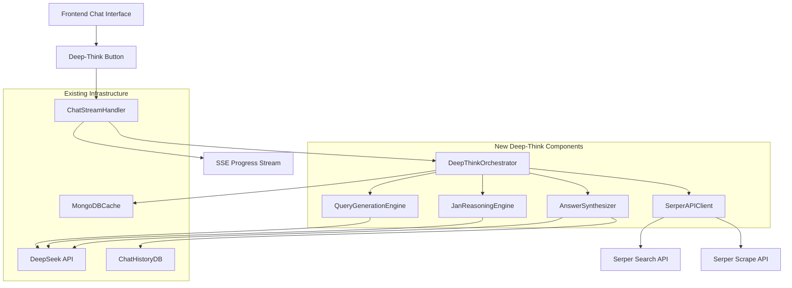
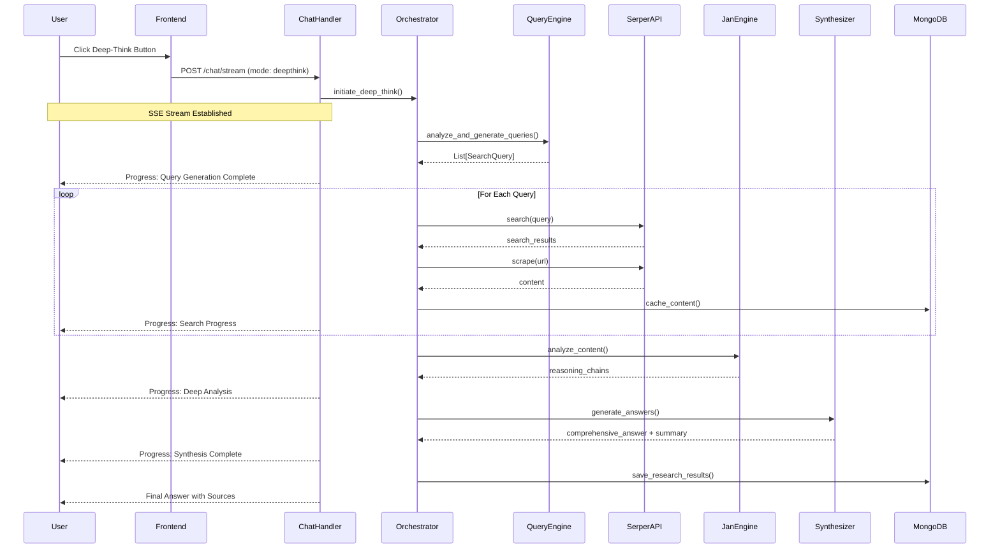
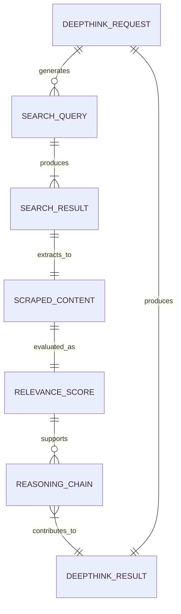

# Technical Design

## Overview

The serper-deep-think-integration feature enhances the existing dxee-china chat application with advanced web research capabilities by integrating the sophisticated algorithm from `test_deepseek_advanced_web_research4_01.py`. This design implements a "deep-think" button interface that triggers comprehensive web research using direct Serper API calls combined with Jan framework's deep-thinking logic, providing users with reasoned, synthesized responses backed by current web information.

The implementation leverages the existing Tornado async architecture, MongoDB storage, and Server-Sent Events streaming infrastructure while introducing new components for web search, content analysis, and AI-powered reasoning.

## Requirements Mapping

### Design Component Traceability
Each design component addresses specific requirements from the requirements document:

- **Deep-Think UI Button** → 1.1-1.5: User interface controls and validation
- **Serper API Client** → 3.1-3.6: Direct API integration with error handling and rate limiting
- **Query Generation Engine** → 2.1-2.5: Multi-perspective query generation from user input
- **Jan Deep-Thinking Processor** → 4.1-4.6: Advanced reasoning and analysis algorithms
- **Progress Streaming System** → 5.1-5.6: Real-time SSE progress updates
- **Answer Synthesis Engine** → 6.1-6.6: Comprehensive and summary response generation
- **Chat Integration Layer** → 7.1-7.6: Seamless chat interface integration
- **Error Recovery System** → 8.1-8.6: Graceful error handling and fallback mechanisms
- **Resource Management System** → 9.1-9.6: Performance optimization and resource controls

### User Story Coverage
- **UI User Story (Req 1)**: Deep-think button component with state management
- **Query Generation Story (Req 2)**: Multi-angle query generation service
- **API Integration Story (Req 3)**: Serper client with retry logic and authentication
- **Deep-Thinking Story (Req 4)**: Jan framework integration with reasoning chains
- **Progress Updates Story (Req 5)**: SSE streaming with step-by-step feedback
- **Answer Generation Story (Req 6)**: Dual-format response synthesis
- **Chat Integration Story (Req 7)**: Seamless message history integration
- **Error Handling Story (Req 8)**: Comprehensive error recovery system
- **Performance Story (Req 9)**: Resource management and optimization

## Architecture



### Technology Stack

Based on existing architecture and research findings:

- **Backend Framework**: Tornado 6.4.2 (async web framework) - maintains consistency with existing system
- **Programming Language**: Python >=3.11 with async/await support
- **HTTP Client**: aiohttp 3.8.5 - used for Serper API integration
- **AI Service**: DeepSeek API via OpenAI client 1.82.0 - leverages existing integration
- **Database**: MongoDB with Motor 3.3.2 async driver - utilizes existing storage infrastructure
- **Caching**: MongoDB-based content caching - extends existing cache system
- **Streaming**: Server-Sent Events (SSE) - uses existing streaming infrastructure
- **Token Management**: tiktoken >=0.9.0 - for AI API optimization
- **Environment Management**: python-dotenv 1.0.0 - consistent with existing configuration

### Architecture Decision Rationale

- **Why Tornado Integration**: Maintains consistency with existing async architecture and leverages established SSE streaming capabilities
- **Why Direct Serper API**: Analysis of test file revealed direct HTTP calls rather than MCP protocol, ensuring accurate implementation
- **Why MongoDB Caching**: Extends existing cache infrastructure with 30-day TTL for performance optimization
- **Why SSE Streaming**: Utilizes proven streaming architecture for real-time progress updates without UI rework
- **Why Component Separation**: Modular design enables maintainability and testing while following existing service patterns

### Data Flow

#### Primary Deep-Think User Flow



## Components and Interfaces

### Backend Services & Method Signatures

```python
class DeepThinkOrchestrator:
    async def initiate_deep_think(self, user_query: str, chat_id: str, progress_callback) -> DeepThinkResult:
        """Main orchestration method for deep-think research workflow"""
        
    async def cleanup_resources(self) -> None:
        """Clean up temporary resources and connections"""

class QueryGenerationEngine:
    async def analyze_question(self, question: str) -> QuestionAnalysis:
        """Analyze user question for entities, intent, and complexity"""
        
    async def generate_search_queries(self, analysis: QuestionAnalysis) -> List[SearchQuery]:
        """Generate 3-5 diverse search queries covering different angles"""
        
    def prioritize_queries(self, queries: List[SearchQuery]) -> List[SearchQuery]:
        """Sort queries by priority and relevance"""

class SerperAPIClient:
    async def search(self, query: SearchQuery) -> List[SearchResult]:
        """Execute web search via Serper API with rate limiting"""
        
    async def scrape_content(self, url: str) -> Optional[ScrapedContent]:
        """Extract full content from URL using Serper scrape endpoint"""
        
    async def batch_search(self, queries: List[SearchQuery]) -> Dict[str, List[SearchResult]]:
        """Execute multiple queries with resource management"""

class JanReasoningEngine:
    async def evaluate_relevance(self, content: ScrapedContent, question: str) -> RelevanceScore:
        """Score content relevance using Jan-style deep reasoning (0-10 scale)"""
        
    async def generate_reasoning_chains(self, contents: List[ScoredContent]) -> ReasoningAnalysis:
        """Create logical reasoning chains explaining conclusions"""
        
    async def identify_contradictions(self, contents: List[ScoredContent]) -> ContradictionAnalysis:
        """Find and analyze conflicting information across sources"""

class AnswerSynthesizer:
    async def generate_comprehensive_answer(self, analysis: ReasoningAnalysis) -> ComprehensiveAnswer:
        """Create detailed answer with citations and confidence indicators"""
        
    async def generate_summary(self, comprehensive_answer: ComprehensiveAnswer) -> AnswerSummary:
        """Create concise summary highlighting key points"""
        
    async def format_for_chat(self, answer: ComprehensiveAnswer, summary: AnswerSummary) -> FormattedResponse:
        """Format responses with markdown for chat display"""

class ResourceManager:
    async def enforce_time_limits(self, start_time: float) -> bool:
        """Check if 10-minute research timeout is approaching"""
        
    async def manage_concurrent_requests(self, user_id: str) -> bool:
        """Ensure reasonable resource usage per user"""
        
    def track_api_usage(self) -> UsageMetrics:
        """Monitor Serper API usage and costs"""
```

### Frontend Components

| Component | Responsibility | Props/State |
|-----------|----------------|-------------|
| DeepThinkButton | Trigger deep-think mode | `disabled`, `onClick`, `loading` |
| ProgressIndicator | Display research progress | `steps`, `currentStep`, `progress` |
| AnswerDisplay | Show expandable answers | `summary`, `fullAnswer`, `sources` |
| ErrorNotification | Handle error states | `error`, `retryAction`, `fallbackOptions` |

### API Endpoints

| Method | Route | Purpose | Auth | Status Codes |
|--------|-------|---------|------|--------------|
| POST | /chat/stream | Streaming chat with deep-think mode | Session | 200, 400, 401, 500, 503 |
| GET | /health | Service health including Serper API status | None | 200, 503 |

#### Extended Chat Stream Endpoint

The existing `/chat/stream` endpoint will be enhanced to handle the new `search_mode: "deepthink"`:

```json
POST /chat/stream
{
    "message": "user question",
    "chat_id": "uuid",
    "search_mode": "deepthink",
    "chat_history": []
}
```

**SSE Response Events:**
```javascript
// Progress updates
data: {"type": "deepthink_progress", "step": "query_generation", "progress": 20, "description": "Analyzing question..."}
data: {"type": "deepthink_progress", "step": "web_search", "progress": 40, "description": "Searching 5 queries..."}
data: {"type": "deepthink_progress", "step": "content_extraction", "progress": 60, "description": "Extracting content from 15 sources..."}
data: {"type": "deepthink_progress", "step": "relevance_analysis", "progress": 80, "description": "Evaluating relevance (12/15 sources above threshold)..."}
data: {"type": "deepthink_progress", "step": "synthesis", "progress": 90, "description": "Generating comprehensive analysis..."}

// Final response
data: {"type": "complete", "content": "formatted_answer", "summary": "key_points", "sources": [...], "confidence": 0.85}
```

## Data Models

### Domain Entities

1. **DeepThinkRequest**: User request with metadata and tracking
2. **SearchQuery**: Enhanced query with operators and priority
3. **ScrapedContent**: Web content with extraction metadata
4. **RelevanceScore**: Content relevance with reasoning
5. **ReasoningChain**: Logical analysis pathway
6. **DeepThinkResult**: Complete research outcome

### Entity Relationships



### Data Model Definitions

```python
@dataclass
class DeepThinkRequest:
    request_id: str
    user_query: str
    chat_id: str
    user_id: str
    timestamp: datetime
    timeout_seconds: int = 600
    max_queries: int = 5

@dataclass
class SearchQuery:
    text: str
    priority: int
    search_type: str  # "factual", "comparative", "temporal", "statistical"
    advanced_operators: Dict[str, str]  # site, filetype, etc.
    generated_from: str  # reasoning for this query

@dataclass
class ScrapedContent:
    url: str
    title: str
    text_content: str
    markdown_content: Optional[str]
    metadata: Dict[str, Any]
    extraction_time: float
    cache_hit: bool
    word_count: int

@dataclass
class RelevanceScore:
    content_id: str
    score: float  # 0-10 scale
    confidence: float  # 0-1 scale
    reasoning: str
    meets_threshold: bool  # >= 7.0
    evaluation_time: float

@dataclass
class ReasoningChain:
    chain_id: str
    premise: str
    evidence: List[str]
    conclusion: str
    confidence: float
    source_urls: List[str]
    contradictions: List[str]

@dataclass
class DeepThinkResult:
    request_id: str
    comprehensive_answer: str
    summary: str
    confidence: float
    sources_analyzed: int
    high_relevance_sources: int
    reasoning_chains: List[ReasoningChain]
    execution_time: float
    cache_hits: int
    api_calls_made: int
```

### Database Schema

```sql
-- MongoDB Collections (Document Structure)

// deepthink_requests
{
  "_id": ObjectId,
  "request_id": "uuid",
  "user_query": "string",
  "chat_id": "string", 
  "user_id": "string",
  "timestamp": ISODate,
  "status": "processing|completed|failed",
  "timeout_seconds": 600,
  "created_at": ISODate,
  "updated_at": ISODate
}

// deepthink_cache (extends existing content cache)
{
  "_id": ObjectId,
  "url": "string",
  "content_hash": "string",
  "scraped_content": {
    "title": "string",
    "text": "string", 
    "markdown": "string",
    "metadata": {}
  },
  "relevance_scores": [
    {
      "query": "string",
      "score": 8.5,
      "confidence": 0.9,
      "reasoning": "string"
    }
  ],
  "cached_at": ISODate,
  "expires_at": ISODate,  // TTL index
  "access_count": 0
}

// deepthink_results
{
  "_id": ObjectId,
  "request_id": "string",
  "result": {
    "comprehensive_answer": "string",
    "summary": "string", 
    "confidence": 0.85,
    "sources": [],
    "reasoning_chains": [],
    "statistics": {}
  },
  "performance_metrics": {
    "execution_time": 45.2,
    "sources_analyzed": 12,
    "cache_hits": 8,
    "api_calls": 15
  },
  "created_at": ISODate
}
```

### Migration Strategy

- **Extend Existing Collections**: Add deep-think specific fields to existing message documents
- **New Collections**: Create dedicated collections for deep-think cache and results
- **Backward Compatibility**: Maintain existing chat functionality without disruption
- **Indexing Strategy**: Add indexes for performance on `url`, `request_id`, and `expires_at` fields

## Error Handling

### Comprehensive Error Strategy

**Error Categories:**
1. **API Errors**: Serper API failures, rate limits, authentication issues
2. **Processing Errors**: Timeout exceeded, content extraction failures, analysis errors
3. **Resource Errors**: Memory limits, concurrent request limits, disk space
4. **Network Errors**: Connection failures, DNS issues, SSL/TLS problems

**Error Recovery Mechanisms:**

```python
class ErrorRecoverySystem:
    async def handle_serper_api_error(self, error: SerperAPIError) -> RecoveryAction:
        """Handle Serper API failures with exponential backoff"""
        
    async def handle_timeout_error(self, partial_results: PartialResults) -> FallbackResponse:
        """Provide best-effort response when timeout occurs"""
        
    async def handle_resource_exhaustion(self, request: DeepThinkRequest) -> QueuedResponse:
        """Queue request when resources are constrained"""
        
    async def graceful_degradation(self, error: Exception) -> FallbackResponse:
        """Fall back to standard chat mode with error notification"""
```

**Error Response Format:**
```json
{
    "type": "error", 
    "error_code": "SERPER_API_UNAVAILABLE",
    "message": "Web search is temporarily unavailable. Trying again in a few minutes.",
    "recovery_options": ["retry", "standard_chat"],
    "estimated_recovery_time": "2-3 minutes"
}
```

## Security Considerations

**API Security:**
- Implement rate limiting for Serper API calls (100 requests/hour per user)
- Secure API key storage using environment variables
- Input validation and sanitization for all user queries
- Content filtering to prevent extraction of sensitive information

**Data Protection:**
- Encrypt cached content containing potentially sensitive information
- Implement TTL (Time To Live) for all cached data (30 days default)
- User consent for data caching and research result storage
- Audit logging for all deep-think requests and API usage

**Resource Protection:**
- Enforce timeout limits (10 minutes) to prevent resource exhaustion
- Implement concurrent request limits (3 per user, 10 system-wide)
- Memory usage monitoring and automatic cleanup
- Circuit breaker pattern for external API dependencies

## Performance & Scalability

### Performance Targets

| Metric | Target | Measurement |
|--------|--------|-------------|
| Deep-Think Response Time (p95) | < 120 seconds | End-to-end research completion |
| Deep-Think Response Time (p99) | < 300 seconds | End-to-end research completion |
| Serper API Response (p95) | < 2 seconds | Individual API calls |
| Cache Hit Rate | > 60% | Content retrieval operations |
| Concurrent Deep-Think Users | > 10 | System capacity |
| Memory Usage per Request | < 500MB | Resource monitoring |

### Caching Strategy

**Multi-Level Caching:**
- **MongoDB Content Cache**: 30-day TTL for scraped web content
- **Query Result Cache**: 24-hour TTL for query-specific results  
- **Relevance Score Cache**: 7-day TTL for content relevance evaluations
- **Answer Fragment Cache**: 1-hour TTL for partial analysis results

**Cache Optimization:**
- Content deduplication using MD5 hashing
- Intelligent cache warming for popular topics
- Background cache refresh for frequently accessed content
- Cache size monitoring with LRU eviction

### Scalability Approach

**Horizontal Scaling:**
- Async processing architecture supports multiple concurrent requests
- MongoDB sharding capability for large datasets
- Independent service scaling (search, analysis, synthesis)
- Load balancing across multiple Tornado workers

**Resource Optimization:**
- Token-aware content summarization (max 2000 chars per source)
- Batch processing for multiple API calls
- Background cleanup of expired cache entries
- Memory-efficient streaming for large responses

**Auto-scaling Triggers:**
- CPU usage > 70% for 5 minutes
- Memory usage > 80% for 3 minutes  
- Response time > 180 seconds for 10 consecutive requests
- Error rate > 5% for 2 minutes

## Testing Strategy

### Risk Matrix

| Area | Risk | Must | Optional | Ref |
|---|---|---|---|---|
| External APIs | **H** | Contract, Integration, Resilience | Load, Chaos | 3.1-3.6 |
| Deep Reasoning | **M** | Unit, Property-based | Performance | 4.1-4.6 |
| SSE Streaming | **M** | Integration, E2E | Browser compatibility | 5.1-5.6 |
| Resource Management | **H** | Unit, Integration | Stress, Memory leak | 9.1-9.6 |
| Error Recovery | **M** | Unit, Fault injection | Resilience | 8.1-8.6 |
| Chat Integration | **L** | E2E (≤2 flows) | A11y | 7.1-7.6 |

### Testing by Layer

**Unit Tests:**
- Query generation algorithms with various input types
- Content relevance scoring accuracy 
- Error handling boundary conditions
- Resource limit enforcement
- Cache hit/miss scenarios

**Contract Tests:**
- Serper API request/response format validation
- DeepSeek API integration contract testing
- MongoDB document schema validation
- SSE event format verification

**Integration Tests:**
- End-to-end deep-think workflow
- Database integration with caching
- External API integration with retry logic
- SSE streaming with progress updates

**End-to-End Tests (≤3):**
1. **Happy Path**: User submits query → receives comprehensive answer with sources
2. **Error Recovery**: API failure → graceful fallback with user notification
3. **Timeout Handling**: Long research → partial results with timeout notification

### CI Gates

| Stage | Run | Gate | SLA |
|---|---|---|---|
| PR | Unit + Contract | Fail = block | ≤3min |
| Staging | Integration + E2E | Fail = block | ≤8min |
| Nightly | Performance + Load | Regression → issue | - |

### Performance Testing

**Baseline Performance Tests:**
- Single user deep-think request completion time
- Serper API response time distribution
- MongoDB query performance with caching
- Memory usage during research workflow

**Load Testing Scenarios:**
- 5 concurrent users performing deep-think research
- 100 cached content lookups per second
- API rate limit boundary testing
- Resource exhaustion and recovery testing

### Exit Criteria

- **Sev1/Sev2 bugs**: 0 remaining
- **All CI gates**: Passing with green status
- **Performance targets**: Met within 10% tolerance
- **Security scan**: No high/critical vulnerabilities
- **Cache performance**: >60% hit rate in load testing
- **Error recovery**: <5% failure rate under normal load