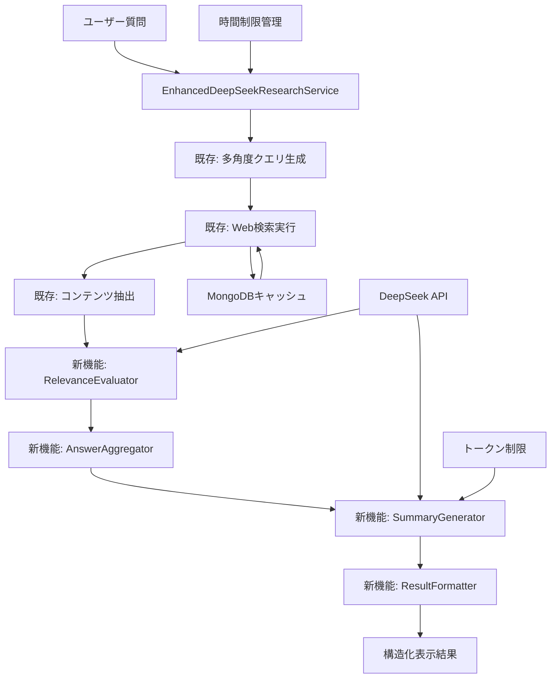

# 技術設計書

## 概要
test_deepseek_advanced_web_research3_07.pyに関連性評価（70%閾値）と回答集計・要約機能を追加する。既存のMongoDB キャッシュ、時間制限、API統合を維持しながら、新しい関連性フィルタリングと要約生成機能を実装する。

## アーキテクチャ



## 技術スタック
- **ベース**: Python 3.11+ (既存)
- **非同期処理**: asyncio (既存)
- **データベース**: MongoDB with Motor (既存)
- **API**: DeepSeek API, Bright Data API (既存)
- **新規追加**: 関連性評価アルゴリズム、回答集計ロジック
- **ログ**: Python logging (既存)
- **パフォーマンス**: 既存のTokenLimitHandler、TimeManagerを拡張

## コンポーネント設計と詳細

### 1. RelevanceEvaluator（新規）
関連性スコア評価を担当する新しいクラス。

```python
class RelevanceEvaluator:
    def __init__(self, api_client: AsyncOpenAI, threshold: float = 0.7):
        self.api_client = api_client
        self.threshold = threshold
        self.evaluation_cache = {}
    
    async def evaluate_relevance(self, question: str, content: str, url: str) -> Dict[str, Any]:
        """コンテンツの関連性を0-10スケールで評価"""
        pass
    
    async def batch_evaluate(self, question: str, contents: List[Dict]) -> List[Dict]:
        """複数コンテンツの一括評価"""
        pass
    
    def meets_threshold(self, score: float) -> bool:
        """70%閾値チェック"""
        return score >= (self.threshold * 10)
```

### 2. AnswerAggregator（新規）
高関連性回答を集計・ランキング。

```python
class AnswerAggregator:
    def __init__(self):
        self.aggregated_answers = []
        self.deduplication_threshold = 0.8
    
    def aggregate_answers(self, evaluated_contents: List[Dict]) -> List[Dict]:
        """70%以上の回答を集計しランキング"""
        pass
    
    def deduplicate_content(self, contents: List[Dict]) -> List[Dict]:
        """重複コンテンツの除去"""
        pass
    
    def rank_by_relevance(self, answers: List[Dict]) -> List[Dict]:
        """関連性スコア順にランキング"""
        pass
```

### 3. SummaryGenerator（新規）
最高関連性回答の要約を生成。

```python
class SummaryGenerator:
    def __init__(self, api_client: AsyncOpenAI, token_handler: TokenLimitHandler):
        self.api_client = api_client
        self.token_handler = token_handler
    
    async def generate_summary(self, question: str, best_answer: Dict) -> Dict[str, Any]:
        """最高関連性回答の要約生成"""
        pass
    
    def create_summary_prompt(self, question: str, content: str) -> str:
        """要約生成用プロンプト作成"""
        pass
    
    async def validate_summary(self, summary: str, original_question: str) -> bool:
        """要約品質検証"""
        pass
```

### 4. ResultFormatter（新規）
結果の構造化表示を担当。

```python
class ResultFormatter:
    def __init__(self):
        self.display_templates = {
            'summary': self._format_summary_template,
            'table': self._format_table_template,
            'fallback': self._format_fallback_template
        }
    
    def format_final_result(self, summary: Dict, aggregated_data: List[Dict]) -> str:
        """最終結果の構造化表示"""
        pass
    
    def _format_summary_template(self, summary: Dict) -> str:
        """要約用テンプレート"""
        pass
    
    def _format_table_template(self, data: List[Dict]) -> str:
        """表形式テンプレート"""
        pass
```

## APIインターフェース

### 既存クラス拡張
`EnhancedDeepSeekResearchService`に新メソッドを追加：

```python
# 新規メソッド追加
async def conduct_relevance_enhanced_research(self, 
                                            original_question: str, 
                                            relevance_threshold: float = 0.7) -> Dict[str, Any]:
    """関連性評価強化版リサーチ実行"""
    pass

async def evaluate_and_aggregate_results(self, 
                                       question: str, 
                                       extracted_contents: List[Dict]) -> Dict[str, Any]:
    """関連性評価と回答集計"""
    pass

async def generate_best_answer_summary(self, 
                                     question: str, 
                                     aggregated_answers: List[Dict]) -> Dict[str, Any]:
    """最適回答要約生成"""
    pass
```

## データモデル

### 関連性評価結果
```python
@dataclass
class RelevanceEvaluation:
    content_id: str
    url: str
    relevance_score: float  # 0-10スケール
    evaluation_reason: str
    meets_threshold: bool
    evaluation_time: datetime
    token_usage: int
```

### 集計済み回答
```python
@dataclass
class AggregatedAnswer:
    content: str
    relevance_score: float
    source_urls: List[str]
    confidence_level: str
    extraction_time: datetime
    is_deduplicated: bool
```

### 要約結果
```python
@dataclass
class SummaryResult:
    original_question: str
    summary_text: str
    relevance_score: float
    source_urls: List[str]
    confidence_metrics: Dict[str, float]
    generation_time: datetime
    token_usage: int
```

## データフロー

1. **質問受付** → EnhancedDeepSeekResearchService
2. **既存処理** → 多角度クエリ生成 → Web検索 → コンテンツ抽出
3. **新規: 関連性評価** → RelevanceEvaluator で各結果を評価
4. **新規: 閾値フィルタリング** → 70%以上の結果のみ選択
5. **新規: 回答集計** → AnswerAggregator で重複除去・ランキング
6. **新規: 要約生成** → SummaryGenerator で最高スコア回答を要約
7. **新規: 結果表示** → ResultFormatter で構造化表示

## エラーハンドリング

### エラーシナリオと対応
1. **関連性評価API失敗** → 既存の統計サマリー生成機能にフォールバック
2. **70%閾値未達** → 追加検索クエリ生成と再実行
3. **要約生成失敗** → 生データ一覧表示
4. **タイムアウト** → 部分結果返却
5. **トークン制限** → コンテンツ要約後に処理継続

```python
class RelevanceEnhancedErrorHandler:
    def __init__(self, fallback_service):
        self.fallback_service = fallback_service
    
    async def handle_relevance_evaluation_error(self, error: Exception, contents: List[Dict]) -> List[Dict]:
        """関連性評価エラー時のフォールバック"""
        logger.warning(f"関連性評価失敗、フォールバック実行: {error}")
        return await self.fallback_service.generate_statistical_summary()
    
    async def handle_threshold_not_met(self, question: str, current_results: List[Dict]) -> List[str]:
        """閾値未達時の追加クエリ生成"""
        return await self.generate_followup_queries(question, current_results)
```

## セキュリティ考慮事項

### データ保護
- **キャッシュセキュリティ**: MongoDB接続の暗号化維持
- **API認証**: DeepSeek API キーの安全な管理
- **ログ**: 機密情報のマスキング
- **入力検証**: SQLインジェクション対策

### プライバシー
- **データ保持**: 既存のキャッシュポリシーに従う
- **ログ管理**: 個人情報の除外
- **API使用**: 利用規約遵守

## パフォーマンス・スケーラビリティ

### パフォーマンス最適化
```python
class PerformanceOptimizer:
    def __init__(self):
        self.evaluation_cache = {}
        self.batch_size = 10
        self.max_concurrent_evaluations = 5
    
    async def optimize_relevance_evaluation(self, contents: List[Dict]) -> List[Dict]:
        """関連性評価の最適化"""
        # バッチ処理、並行処理、キャッシュ活用
        pass
    
    def estimate_processing_time(self, content_count: int) -> float:
        """処理時間予測"""
        return content_count * 3.0  # 3秒/件の基準
```

### 制約と目標
- **関連性評価**: 3秒/件以内
- **回答集計**: 50件を30秒以内
- **要約生成**: 1分以内
- **全体制限**: 10分以内（既存制限維持）

## テスト戦略

### 単体テスト
```python
class TestRelevanceEvaluator:
    async def test_relevance_scoring(self):
        """関連性スコアリングのテスト"""
        pass
    
    async def test_threshold_filtering(self):
        """70%閾値フィルタリングのテスト"""
        pass

class TestAnswerAggregator:
    def test_deduplication(self):
        """重複除去のテスト"""
        pass
    
    def test_ranking(self):
        """ランキング機能のテスト"""
        pass
```

### 統合テスト
```python
class TestIntegration:
    async def test_full_workflow(self):
        """全体ワークフローのテスト"""
        pass
    
    async def test_fallback_scenarios(self):
        """フォールバックシナリオのテスト"""
        pass
    
    async def test_performance_benchmarks(self):
        """パフォーマンス基準のテスト"""
        pass
```

### エンドツーエンドテスト
- 実際のWeb検索から要約表示までの完全フロー
- 既存機能との互換性確認
- エラーシナリオでの動作確認
- パフォーマンス基準の検証