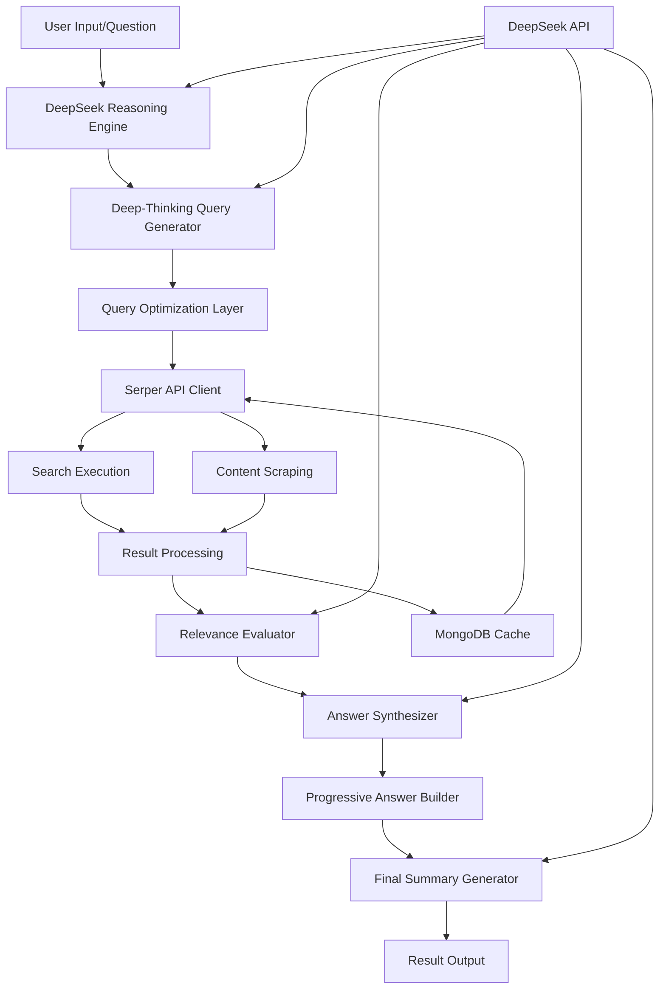

# Technical Design
## DeepSeek Web Research with Serper MCP Integration

## Overview
This design document outlines the technical implementation of `test_deepseek_advanced_web_research4_01.py`, which integrates DeepSeek's advanced reasoning capabilities with Serper API for professional web search. The system leverages deep-thinking algorithms inspired by the 'jan' project for intelligent query formulation and implements the MCP (Model Context Protocol) server patterns from 'mcp-server-serper' for structured API interactions.

**Implementation Focus**: This design combines proven components from multiple sources:
- Advanced research workflow from `test_deepseek_advanced_web_research3_07.py`
- Deep-thinking query generation patterns from the 'jan' project
- Serper API integration patterns from 'mcp-server-serper'
- DeepSeek reasoning capabilities via OpenAI-compatible API

## Architecture



## Technology Stack
- **Language**: Python 3.11+
- **Async Framework**: asyncio with aiohttp
- **LLM Integration**: DeepSeek via OpenAI SDK
- **Search API**: Serper API (Google Search + Web Scraping)
- **Database**: MongoDB (optional caching layer)
- **Token Management**: tiktoken for token counting
- **Data Validation**: Pydantic for data models
- **Testing**: pytest with pytest-asyncio
- **Environment**: python-dotenv for configuration

## Components and Interfaces

### 1. DeepSeek Integration Layer

#### DeepSeekClient
```python
class DeepSeekClient:
    """Wrapper for DeepSeek API using OpenAI interface"""
    def __init__(self, api_key: str, model: str = "deepseek-chat"):
        self.client = AsyncOpenAI(
            api_key=api_key,
            base_url="https://api.deepseek.com"
        )
        self.model = model
        self.token_counter = TokenCounter()
    
    async def reason(self, prompt: str, temperature: float = 0.7) -> str:
        """Execute reasoning task with DeepSeek"""
        pass
    
    async def analyze_question(self, question: str) -> QuestionAnalysis:
        """Deep analysis of research question"""
        pass
    
    async def evaluate_relevance(self, question: str, content: str) -> float:
        """Score content relevance (0-1 scale)"""
        pass
```

#### TokenManager
```python
class TokenManager:
    """Manage token limits and optimization"""
    def __init__(self, max_tokens: int = 50000):
        self.max_tokens = max_tokens
        self.encoding = tiktoken.encoding_for_model("gpt-3.5-turbo")
    
    def count_tokens(self, text: str) -> int:
        """Count tokens in text"""
        pass
    
    def optimize_content(self, content: str, max_length: int) -> str:
        """Intelligently truncate content to fit token limits"""
        pass
    
    def estimate_cost(self, input_tokens: int, output_tokens: int) -> float:
        """Estimate API cost"""
        pass
```

### 2. Deep-Thinking Query Generation

#### DeepThinkingEngine
```python
class DeepThinkingEngine:
    """Advanced query generation using deep-thinking patterns"""
    def __init__(self, llm_client: DeepSeekClient):
        self.llm = llm_client
        self.query_patterns = QueryPatterns()
    
    async def generate_queries(self, question: str, context: Dict = None) -> List[SearchQuery]:
        """Generate multi-angle search queries"""
        phases = [
            self.decompose_question,
            self.identify_perspectives,
            self.generate_variants,
            self.apply_operators,
            self.prioritize_queries
        ]
        
        queries = []
        for phase in phases:
            queries.extend(await phase(question, context))
        
        return self.deduplicate_queries(queries)
    
    async def decompose_question(self, question: str, context: Dict) -> List[str]:
        """Break down question into core components"""
        pass
    
    async def identify_perspectives(self, question: str, context: Dict) -> List[str]:
        """Generate queries from different viewpoints"""
        perspectives = [
            "technical_expert",
            "business_analyst", 
            "end_user",
            "researcher",
            "critic"
        ]
        pass
    
    async def generate_variants(self, base_query: str) -> List[str]:
        """Create query variations with synonyms"""
        pass
    
    async def apply_operators(self, queries: List[str]) -> List[SearchQuery]:
        """Apply advanced search operators"""
        pass
    
    async def prioritize_queries(self, queries: List[SearchQuery]) -> List[SearchQuery]:
        """Rank queries by expected value"""
        pass
```

#### QueryPatterns
```python
class QueryPatterns:
    """Repository of query generation patterns"""
    
    FACTUAL_PATTERNS = [
        "what is {topic}",
        "define {topic}",
        "{topic} explanation"
    ]
    
    COMPARATIVE_PATTERNS = [
        "{topic} vs {alternative}",
        "compare {topic} with {alternative}",
        "difference between {topic} and {alternative}"
    ]
    
    TEMPORAL_PATTERNS = [
        "{topic} in {year}",
        "latest {topic}",
        "{topic} trends",
        "future of {topic}"
    ]
    
    CAUSAL_PATTERNS = [
        "why {topic}",
        "{topic} causes",
        "{topic} effects",
        "impact of {topic}"
    ]
    
    def apply_pattern(self, pattern: str, entities: Dict) -> str:
        """Apply pattern with entity substitution"""
        pass
```

### 3. Serper API Integration

#### SerperClient
```python
class SerperClient:
    """Enhanced Serper API client with MCP patterns"""
    def __init__(self, api_key: str):
        self.api_key = api_key
        self.base_url = "https://google.serper.dev"
        self.scrape_url = "https://scrape.serper.dev"
        self.session = None
        self.rate_limiter = RateLimiter()
    
    async def search(self, query: SearchQuery) -> SearchResult:
        """Execute web search with advanced parameters"""
        params = self.build_search_params(query)
        response = await self.execute_api_call("/search", params)
        return self.parse_search_result(response)
    
    async def scrape(self, url: str, include_markdown: bool = True) -> ScrapeResult:
        """Scrape webpage content"""
        params = {
            "url": url,
            "includeMarkdown": include_markdown
        }
        response = await self.execute_api_call(self.scrape_url, params, is_scrape=True)
        return self.parse_scrape_result(response)
    
    def build_search_params(self, query: SearchQuery) -> Dict:
        """Build Serper API parameters from query object"""
        params = {
            "q": self.build_advanced_query(query),
            "gl": query.region or "us",
            "hl": query.language or "en",
            "num": query.num_results or 10
        }
        
        # Add optional parameters
        if query.time_filter:
            params["tbs"] = query.time_filter
        if query.page:
            params["page"] = query.page
            
        return params
    
    def build_advanced_query(self, query: SearchQuery) -> str:
        """Construct query string with operators"""
        q = query.text
        
        # Apply search operators
        if query.site:
            q += f" site:{query.site}"
        if query.filetype:
            q += f" filetype:{query.filetype}"
        if query.intitle:
            q += f" intitle:{query.intitle}"
        if query.exact_phrase:
            q += f' "{query.exact_phrase}"'
        if query.exclude_terms:
            for term in query.exclude_terms:
                q += f" -{term}"
        if query.or_terms:
            q += f" ({' OR '.join(query.or_terms)})"
            
        return q.strip()
```

#### RateLimiter
```python
class RateLimiter:
    """Rate limiting for API calls"""
    def __init__(self):
        self.limits = {
            'search': 100,  # per minute
            'scrape': 50    # per minute
        }
        self.call_history = defaultdict(list)
    
    async def wait_if_needed(self, api_type: str):
        """Wait if rate limit would be exceeded"""
        pass
    
    def record_call(self, api_type: str):
        """Record API call for rate limiting"""
        pass
```

### 4. Result Processing & Synthesis

#### ResultProcessor
```python
class ResultProcessor:
    """Process and analyze search results"""
    def __init__(self, llm_client: DeepSeekClient):
        self.llm = llm_client
        self.relevance_threshold = 0.7
    
    async def process_results(self, results: List[SearchResult], question: str) -> ProcessedResults:
        """Process raw search results"""
        # Extract content
        contents = await self.extract_contents(results)
        
        # Evaluate relevance
        scored_contents = await self.evaluate_relevance_batch(contents, question)
        
        # Filter by threshold
        relevant_contents = self.filter_by_threshold(scored_contents)
        
        # Deduplicate
        unique_contents = self.deduplicate(relevant_contents)
        
        return ProcessedResults(
            contents=unique_contents,
            total_processed=len(results),
            relevant_count=len(unique_contents)
        )
    
    async def extract_contents(self, results: List[SearchResult]) -> List[Content]:
        """Extract and structure content from results"""
        pass
    
    async def evaluate_relevance_batch(self, contents: List[Content], question: str) -> List[ScoredContent]:
        """Batch evaluate content relevance"""
        pass
    
    def filter_by_threshold(self, contents: List[ScoredContent]) -> List[ScoredContent]:
        """Filter contents meeting relevance threshold"""
        pass
    
    def deduplicate(self, contents: List[ScoredContent]) -> List[ScoredContent]:
        """Remove duplicate content"""
        pass
```

#### AnswerSynthesizer
```python
class AnswerSynthesizer:
    """Synthesize comprehensive answers from sources"""
    def __init__(self, llm_client: DeepSeekClient):
        self.llm = llm_client
        self.answer_builder = ProgressiveAnswerBuilder()
    
    async def synthesize(self, question: str, contents: List[ScoredContent]) -> Answer:
        """Generate comprehensive answer"""
        # Build initial answer
        initial = await self.create_initial_answer(question, contents[:5])
        
        # Progressively refine with additional sources
        refined = await self.refine_answer(initial, contents[5:])
        
        # Generate final summary
        summary = await self.generate_summary(refined, question)
        
        # Extract statistics if available
        stats = await self.extract_statistics(contents)
        
        return Answer(
            content=summary,
            confidence=self.calculate_confidence(contents),
            sources=self.format_sources(contents),
            statistics=stats
        )
    
    async def create_initial_answer(self, question: str, sources: List[ScoredContent]) -> str:
        """Create initial answer from top sources"""
        pass
    
    async def refine_answer(self, current: str, additional: List[ScoredContent]) -> str:
        """Iteratively refine answer with new sources"""
        pass
    
    async def generate_summary(self, answer: str, question: str) -> str:
        """Generate final polished summary"""
        pass
    
    async def extract_statistics(self, contents: List[ScoredContent]) -> Dict:
        """Extract numerical data and statistics"""
        pass
```

### 5. Progressive Answer Building

#### ProgressiveAnswerBuilder
```python
class ProgressiveAnswerBuilder:
    """Build answers progressively as research progresses"""
    def __init__(self):
        self.answer_versions = []
        self.current_answer = ""
        self.confidence = 0.0
        self.knowledge_gaps = []
    
    async def update(self, new_content: ScoredContent) -> bool:
        """Update answer with new content"""
        if self.is_valuable_addition(new_content):
            self.current_answer = await self.integrate_content(
                self.current_answer, 
                new_content
            )
            self.update_confidence(new_content.relevance_score)
            self.identify_gaps()
            self.save_version()
            return True
        return False
    
    def is_valuable_addition(self, content: ScoredContent) -> bool:
        """Determine if content adds value"""
        pass
    
    async def integrate_content(self, current: str, new: ScoredContent) -> str:
        """Integrate new content into answer"""
        pass
    
    def update_confidence(self, new_score: float):
        """Update answer confidence"""
        pass
    
    def identify_gaps(self):
        """Identify remaining knowledge gaps"""
        pass
    
    def save_version(self):
        """Save answer version for tracking"""
        pass
```

## Data Flow

### Research Workflow Sequence

1. **Initialization Phase**
   - Load configuration and API keys
   - Initialize DeepSeek client
   - Setup Serper client
   - Connect to MongoDB cache (optional)

2. **Question Analysis Phase**
   - Parse user question with DeepSeek
   - Identify key concepts and entities
   - Determine research scope and depth
   - Extract implicit requirements

3. **Query Generation Phase**
   - Apply deep-thinking algorithms
   - Generate multi-perspective queries
   - Apply search operators strategically
   - Prioritize queries by expected value

4. **Search Execution Phase**
   - Check MongoDB cache for existing results
   - Execute Serper API searches
   - Handle rate limiting and retries
   - Collect raw search results

5. **Content Extraction Phase**
   - Scrape promising URLs
   - Extract text and metadata
   - Handle extraction failures gracefully
   - Cache successful extractions

6. **Relevance Evaluation Phase**
   - Score content relevance with DeepSeek
   - Apply relevance threshold (0.7)
   - Filter low-relevance content
   - Rank by relevance scores

7. **Answer Synthesis Phase**
   - Build initial answer from top sources
   - Progressively refine with additional content
   - Extract statistical data
   - Generate comprehensive summary

8. **Gap Analysis Phase**
   - Identify missing information
   - Generate follow-up queries if needed
   - Iterate until satisfaction or timeout

9. **Final Output Phase**
   - Format final answer
   - Include source citations
   - Add confidence scores
   - Return complete research result

## Data Models

### Core Data Structures

```python
@dataclass
class SearchQuery:
    """Enhanced search query with operators"""
    text: str
    priority: int = 1
    search_type: str = "general"  # general, news, academic, images
    region: str = "us"
    language: str = "en"
    time_filter: Optional[str] = None  # qdr:h, qdr:d, qdr:w, qdr:m, qdr:y
    num_results: int = 10
    page: int = 1
    
    # Advanced operators
    site: Optional[str] = None
    filetype: Optional[str] = None
    intitle: Optional[str] = None
    inurl: Optional[str] = None
    exact_phrase: Optional[str] = None
    exclude_terms: List[str] = field(default_factory=list)
    or_terms: List[str] = field(default_factory=list)
    date_before: Optional[str] = None
    date_after: Optional[str] = None

@dataclass
class SearchResult:
    """Raw search result from Serper"""
    url: str
    title: str
    snippet: str
    position: int
    domain: str
    cached_url: Optional[str] = None
    
@dataclass
class ScrapeResult:
    """Content scraped from webpage"""
    url: str
    text: str
    markdown: Optional[str] = None
    metadata: Dict[str, Any] = field(default_factory=dict)
    json_ld: Optional[Dict] = None
    extraction_time: float = 0.0
    
@dataclass
class ScoredContent:
    """Content with relevance score"""
    url: str
    title: str
    content: str
    relevance_score: float  # 0-1 scale
    confidence: float
    source_quality: int  # 1-10 scale
    extraction_method: str
    timestamp: datetime
    
@dataclass
class ProcessedResults:
    """Processed and filtered results"""
    contents: List[ScoredContent]
    total_processed: int
    relevant_count: int
    average_relevance: float
    processing_time: float
    
@dataclass
class Answer:
    """Final synthesized answer"""
    content: str
    confidence: float
    sources: List[str]
    statistics: Optional[Dict] = None
    gaps: List[str] = field(default_factory=list)
    versions: List[Dict] = field(default_factory=list)
    generation_time: float = 0.0
    
@dataclass
class ResearchResult:
    """Complete research output"""
    question: str
    answer: Answer
    queries_generated: int
    sources_analyzed: int
    cache_hits: int
    total_duration: float
    metadata: Dict[str, Any] = field(default_factory=dict)
```

### MongoDB Cache Schema

```javascript
// Web Content Cache Collection
{
    _id: ObjectId,
    url: "https://example.com/page",
    url_hash: "sha256_hash",
    content: {
        text: "Extracted text content...",
        markdown: "# Markdown content...",
        title: "Page Title",
        description: "Meta description",
        metadata: {
            author: "Author Name",
            published_date: ISODate,
            tags: ["tag1", "tag2"]
        }
    },
    extraction_method: "serper_scrape",
    extraction_time: 1.234,
    relevance_scores: {
        "question_hash_1": 0.85,
        "question_hash_2": 0.72
    },
    created_at: ISODate,
    expires_at: ISODate,
    access_count: 5,
    last_accessed: ISODate
}

// Research Session Collection
{
    _id: ObjectId,
    session_id: "uuid",
    question: "Original research question",
    queries: [
        {
            text: "search query",
            operators: {...},
            results_count: 10,
            execution_time: 0.5
        }
    ],
    results: {
        total_sources: 25,
        relevant_sources: 18,
        answer_versions: 3,
        final_confidence: 0.85
    },
    answer: {
        content: "Final answer...",
        statistics: {...},
        sources: [...]
    },
    metrics: {
        total_duration: 45.2,
        api_calls: 15,
        cache_hits: 8,
        tokens_used: 12500
    },
    created_at: ISODate
}
```

## Error Handling

### Error Recovery Strategy

```python
class ErrorRecoveryStrategy:
    """Comprehensive error handling and recovery"""
    
    def __init__(self):
        self.retry_config = {
            'max_retries': 3,
            'backoff_factor': 2,
            'max_backoff': 60
        }
        self.fallback_handlers = {}
    
    async def handle_api_error(self, error: Exception, context: Dict) -> Any:
        """Handle API failures with retry and fallback"""
        if isinstance(error, RateLimitError):
            await self.handle_rate_limit(error)
        elif isinstance(error, AuthenticationError):
            raise  # Cannot recover
        elif isinstance(error, TimeoutError):
            return await self.handle_timeout(context)
        else:
            return await self.retry_with_backoff(context)
    
    async def handle_rate_limit(self, error: RateLimitError):
        """Handle rate limiting with exponential backoff"""
        wait_time = error.retry_after or self.calculate_backoff()
        await asyncio.sleep(wait_time)
    
    async def handle_timeout(self, context: Dict) -> Any:
        """Handle timeout with partial results"""
        return PartialResult(
            completed=context.get('completed_tasks', []),
            pending=context.get('pending_tasks', []),
            reason="timeout"
        )
    
    async def retry_with_backoff(self, context: Dict) -> Any:
        """Retry operation with exponential backoff"""
        pass
```

### Error Types and Responses

```python
class ResearchError(Exception):
    """Base exception for research errors"""
    pass

class APIError(ResearchError):
    """API-related errors"""
    pass

class RateLimitError(APIError):
    """Rate limit exceeded"""
    def __init__(self, message: str, retry_after: int = None):
        super().__init__(message)
        self.retry_after = retry_after

class ContentExtractionError(ResearchError):
    """Content extraction failed"""
    pass

class TokenLimitError(ResearchError):
    """Token limit exceeded"""
    pass

class RelevanceThresholdError(ResearchError):
    """No content meets relevance threshold"""
    pass
```

## Security Considerations

### API Key Management
```python
class SecureConfig:
    """Secure configuration management"""
    
    @classmethod
    def load_api_keys(cls) -> Dict[str, str]:
        """Load API keys from environment"""
        required_keys = [
            'DEEPSEEK_API_KEY',
            'SERPER_API_KEY'
        ]
        
        keys = {}
        for key in required_keys:
            value = os.getenv(key)
            if not value:
                raise ValueError(f"Missing required API key: {key}")
            keys[key] = value
            
        return keys
    
    @classmethod
    def validate_api_access(cls, keys: Dict[str, str]) -> bool:
        """Validate API keys have proper access"""
        pass
```

### Content Sanitization
```python
class ContentSanitizer:
    """Sanitize extracted content"""
    
    def sanitize(self, content: str) -> str:
        """Remove sensitive information"""
        # Remove emails
        content = re.sub(r'\b[A-Za-z0-9._%+-]+@[A-Za-z0-9.-]+\.[A-Z|a-z]{2,}\b', '[EMAIL]', content)
        
        # Remove phone numbers
        content = re.sub(r'\b\d{3}[-.]?\d{3}[-.]?\d{4}\b', '[PHONE]', content)
        
        # Remove SSNs
        content = re.sub(r'\b\d{3}-\d{2}-\d{4}\b', '[SSN]', content)
        
        # Remove credit cards
        content = re.sub(r'\b\d{4}[\s-]?\d{4}[\s-]?\d{4}[\s-]?\d{4}\b', '[CARD]', content)
        
        return content
```

## Performance & Scalability

### Optimization Strategies

```python
class PerformanceOptimizer:
    """Performance optimization utilities"""
    
    def __init__(self):
        self.cache = CacheManager()
        self.pool = ConnectionPool()
        self.metrics = MetricsCollector()
    
    async def optimize_search_batch(self, queries: List[SearchQuery]) -> List[SearchResult]:
        """Optimize batch search execution"""
        # Group similar queries
        grouped = self.group_similar_queries(queries)
        
        # Check cache first
        cached, uncached = await self.check_cache_batch(grouped)
        
        # Execute uncached in parallel
        tasks = [self.execute_search(q) for q in uncached]
        new_results = await asyncio.gather(*tasks)
        
        # Cache new results
        await self.cache_results_batch(new_results)
        
        return cached + new_results
    
    def group_similar_queries(self, queries: List[SearchQuery]) -> Dict[str, List[SearchQuery]]:
        """Group queries by similarity for optimization"""
        pass
    
    async def check_cache_batch(self, queries: List[SearchQuery]) -> Tuple[List, List]:
        """Check cache for multiple queries"""
        pass
```

### Resource Management

```python
class ResourceManager:
    """Manage system resources"""
    
    # Resource limits
    MAX_CONCURRENT_REQUESTS = 5
    MAX_CONTENT_SIZE = 1_000_000  # 1MB
    MAX_MEMORY_USAGE = 500_000_000  # 500MB
    SESSION_TIMEOUT = 600  # 10 minutes
    
    # Rate limits
    RATE_LIMITS = {
        'deepseek': 60,  # per minute
        'serper_search': 100,  # per minute
        'serper_scrape': 50  # per minute
    }
    
    def __init__(self):
        self.semaphore = asyncio.Semaphore(self.MAX_CONCURRENT_REQUESTS)
        self.memory_monitor = MemoryMonitor()
        self.rate_limiters = {
            key: RateLimiter(limit) 
            for key, limit in self.RATE_LIMITS.items()
        }
    
    async def acquire_resource(self, resource_type: str):
        """Acquire resource with limits"""
        async with self.semaphore:
            await self.rate_limiters[resource_type].wait_if_needed()
            if self.memory_monitor.usage > self.MAX_MEMORY_USAGE:
                await self.cleanup_memory()
            yield
    
    async def cleanup_memory(self):
        """Clean up memory when approaching limits"""
        pass
```

## Testing Strategy

### Unit Tests

```python
class TestDeepThinkingEngine:
    """Test deep-thinking query generation"""
    
    @pytest.mark.asyncio
    async def test_query_generation(self):
        """Test multi-angle query generation"""
        engine = DeepThinkingEngine(mock_llm)
        queries = await engine.generate_queries("What is quantum computing?")
        
        assert len(queries) >= 5
        assert any("technical" in q.search_type for q in queries)
        assert any(q.site is not None for q in queries)
    
    @pytest.mark.asyncio
    async def test_perspective_generation(self):
        """Test perspective-based queries"""
        pass
    
    @pytest.mark.asyncio
    async def test_operator_application(self):
        """Test search operator application"""
        pass
```

### Integration Tests

```python
class TestSerperIntegration:
    """Test Serper API integration"""
    
    @pytest.mark.asyncio
    async def test_search_execution(self):
        """Test search with real API"""
        client = SerperClient(os.getenv("SERPER_API_KEY"))
        query = SearchQuery(
            text="Python programming",
            num_results=5,
            region="us"
        )
        results = await client.search(query)
        
        assert len(results.organic) <= 5
        assert all(r.url for r in results.organic)
    
    @pytest.mark.asyncio
    async def test_content_scraping(self):
        """Test webpage scraping"""
        pass
    
    @pytest.mark.asyncio
    async def test_rate_limiting(self):
        """Test rate limit handling"""
        pass
```

### End-to-End Tests

```python
class TestResearchWorkflow:
    """Test complete research workflow"""
    
    @pytest.mark.asyncio
    async def test_full_research_cycle(self):
        """Test end-to-end research process"""
        researcher = DeepSeekResearcher(
            deepseek_key=os.getenv("DEEPSEEK_API_KEY"),
            serper_key=os.getenv("SERPER_API_KEY")
        )
        
        result = await researcher.research(
            "What are the latest advances in renewable energy?"
        )
        
        assert result.answer.content
        assert result.answer.confidence > 0.5
        assert len(result.answer.sources) > 0
        assert result.total_duration < 600  # 10 minutes
    
    @pytest.mark.asyncio
    async def test_progressive_answer_building(self):
        """Test progressive answer updates"""
        pass
    
    @pytest.mark.asyncio
    async def test_relevance_filtering(self):
        """Test 70% relevance threshold"""
        pass
```

## Deployment Plan

### Environment Setup

```bash
# Development environment
python -m venv venv
source venv/bin/activate
pip install -r requirements.txt

# Environment variables (.env)
DEEPSEEK_API_KEY=your_key
SERPER_API_KEY=your_key
MONGODB_URI=mongodb://localhost:27017
CACHE_EXPIRY_DAYS=30
LOG_LEVEL=INFO
```

### Docker Configuration

```dockerfile
FROM python:3.11-slim

WORKDIR /app

COPY requirements.txt .
RUN pip install --no-cache-dir -r requirements.txt

COPY . .

ENV PYTHONUNBUFFERED=1

CMD ["python", "test_deepseek_advanced_web_research4_01.py"]
```

### CI/CD Pipeline

```yaml
# .github/workflows/research-tests.yml
name: Research System Tests

on:
  push:
    paths:
      - 'backend/test_deepseek_advanced_web_research4_01.py'
      - 'backend/app/research/**'

jobs:
  test:
    runs-on: ubuntu-latest
    steps:
      - uses: actions/checkout@v2
      - uses: actions/setup-python@v2
        with:
          python-version: '3.11'
      - run: pip install -r requirements.txt
      - run: pytest tests/test_research.py
```

## Monitoring & Logging

### Logging Configuration

```python
import logging
from logging.handlers import RotatingFileHandler

def setup_logging():
    """Configure comprehensive logging"""
    
    # Create formatters
    detailed_formatter = logging.Formatter(
        '%(asctime)s - %(name)s - %(levelname)s - %(funcName)s:%(lineno)d - %(message)s'
    )
    
    simple_formatter = logging.Formatter(
        '%(asctime)s - %(levelname)s - %(message)s'
    )
    
    # File handler for all logs
    file_handler = RotatingFileHandler(
        'research.log',
        maxBytes=10485760,  # 10MB
        backupCount=5
    )
    file_handler.setFormatter(detailed_formatter)
    file_handler.setLevel(logging.DEBUG)
    
    # Console handler for important logs
    console_handler = logging.StreamHandler()
    console_handler.setFormatter(simple_formatter)
    console_handler.setLevel(logging.INFO)
    
    # Configure root logger
    root_logger = logging.getLogger()
    root_logger.setLevel(logging.DEBUG)
    root_logger.addHandler(file_handler)
    root_logger.addHandler(console_handler)
    
    # Specialized loggers
    api_logger = logging.getLogger('api')
    api_logger.setLevel(logging.INFO)
    
    performance_logger = logging.getLogger('performance')
    performance_logger.setLevel(logging.INFO)
```

### Metrics Collection

```python
class MetricsCollector:
    """Collect and report metrics"""
    
    def __init__(self):
        self.metrics = defaultdict(list)
        self.timers = {}
    
    def record_metric(self, name: str, value: float):
        """Record a metric value"""
        self.metrics[name].append({
            'value': value,
            'timestamp': datetime.utcnow()
        })
    
    def start_timer(self, name: str):
        """Start a timer"""
        self.timers[name] = time.time()
    
    def stop_timer(self, name: str) -> float:
        """Stop timer and record duration"""
        if name in self.timers:
            duration = time.time() - self.timers[name]
            self.record_metric(f"{name}_duration", duration)
            del self.timers[name]
            return duration
        return 0.0
    
    def get_summary(self) -> Dict:
        """Get metrics summary"""
        summary = {}
        for name, values in self.metrics.items():
            if values:
                summary[name] = {
                    'count': len(values),
                    'mean': statistics.mean([v['value'] for v in values]),
                    'median': statistics.median([v['value'] for v in values]),
                    'min': min(v['value'] for v in values),
                    'max': max(v['value'] for v in values)
                }
        return summary
```

## Documentation

### API Documentation

```python
"""
DeepSeek Advanced Web Research API v4.01

This module implements an advanced web research system combining:
- DeepSeek LLM for reasoning and analysis
- Serper API for web search and content extraction
- Deep-thinking algorithms for intelligent query generation
- Progressive answer building with relevance evaluation

Example Usage:
    >>> researcher = DeepSeekResearcher(
    ...     deepseek_api_key="your_key",
    ...     serper_api_key="your_key"
    ... )
    >>> result = await researcher.research(
    ...     "What are the latest advances in quantum computing?"
    ... )
    >>> print(result.answer.content)

Classes:
    DeepSeekResearcher: Main research orchestrator
    SerperClient: Serper API client
    DeepThinkingEngine: Query generation engine
    AnswerSynthesizer: Answer synthesis and formatting

Functions:
    research(question: str) -> ResearchResult
    generate_queries(question: str) -> List[SearchQuery]
    synthesize_answer(sources: List[Source]) -> Answer
"""
```

### User Guide

```markdown
# DeepSeek Advanced Web Research User Guide

## Quick Start

1. Install dependencies:
   ```bash
   pip install openai aiohttp pymongo tiktoken pydantic python-dotenv
   ```

2. Set environment variables:
   ```bash
   export DEEPSEEK_API_KEY="your_deepseek_key"
   export SERPER_API_KEY="your_serper_key"
   ```

3. Run research:
   ```python
   python test_deepseek_advanced_web_research4_01.py
   ```

## Configuration Options

- `MAX_QUERIES`: Maximum queries per research (default: 10)
- `RELEVANCE_THRESHOLD`: Minimum relevance score (default: 0.7)
- `TIMEOUT`: Research timeout in seconds (default: 600)
- `CACHE_ENABLED`: Enable MongoDB caching (default: true)

## Advanced Features

### Custom Query Patterns
Add custom query patterns for specific domains...

### Result Filtering
Configure custom relevance filters...

### Statistics Extraction
Enable automatic statistics extraction...
```

## Migration Strategy

### From v3.07 to v4.01

```python
class MigrationHelper:
    """Helper for migrating from v3.07 to v4.01"""
    
    @staticmethod
    def migrate_config(old_config: Dict) -> Dict:
        """Migrate configuration from v3.07"""
        new_config = {
            'deepseek_api_key': old_config.get('DEEPSEEK_API_KEY'),
            'serper_api_key': old_config.get('SERPER_API_KEY'),  # New
            'mongodb_uri': old_config.get('MONGODB_URI'),
            'cache_expiry': old_config.get('CACHE_EXPIRY_DAYS', 30),
            'max_research_time': old_config.get('MAX_RESEARCH_TIME', 600)
        }
        
        # Remove deprecated Google API config
        # Add new Serper configuration
        
        return new_config
    
    @staticmethod
    def migrate_data_models(old_data: Dict) -> Dict:
        """Migrate data structures"""
        # Convert old search results to new format
        # Update cache schema
        # Transform answer format
        pass
```

## Rollback Plan

### Emergency Rollback Procedure

1. **Detection of Issues**
   - Monitor error rates > 10%
   - API response times > 5s
   - Memory usage > 80%

2. **Rollback Steps**
   ```bash
   # Stop current version
   pkill -f test_deepseek_advanced_web_research4_01.py
   
   # Restore previous version
   git checkout v3.07
   pip install -r requirements.v3.07.txt
   
   # Restart service
   python test_deepseek_advanced_web_research3_07.py
   ```

3. **Data Recovery**
   - Cache remains compatible
   - No database migrations needed
   - API keys unchanged

## Timeline & Milestones

### Phase 1: Foundation (Week 1)
- [x] Requirements gathering
- [x] Design documentation
- [ ] Environment setup
- [ ] Basic Serper integration

### Phase 2: Core Implementation (Week 2)
- [ ] Deep-thinking engine
- [ ] Query generation
- [ ] Result processing
- [ ] Answer synthesis

### Phase 3: Integration (Week 3)
- [ ] MongoDB caching
- [ ] Progressive answers
- [ ] Error handling
- [ ] Performance optimization

### Phase 4: Testing & Deployment (Week 4)
- [ ] Unit tests
- [ ] Integration tests
- [ ] Performance testing
- [ ] Production deployment

## Success Criteria

### Performance Metrics
- Research completion < 10 minutes
- Relevance score > 70% for 80% of queries
- API error rate < 1%
- Cache hit rate > 40%

### Quality Metrics
- Answer completeness > 85%
- Source diversity (minimum 5 unique domains)
- Statistical data extraction success > 60%
- User satisfaction score > 4.0/5.0

### Business Metrics
- Cost per research < $0.50
- Daily research capacity > 1000
- System uptime > 99.5%
- Response time < 2s for cached results

---

*End of Technical Design Document v1.0*
